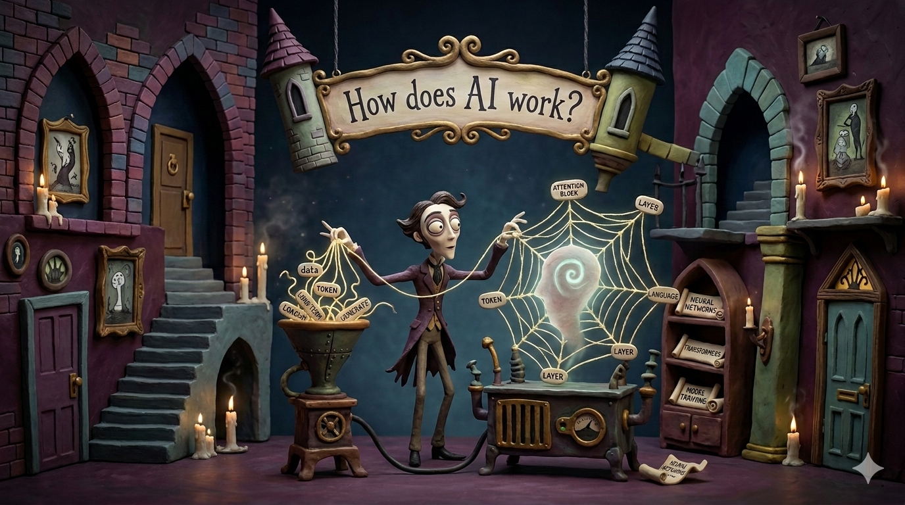
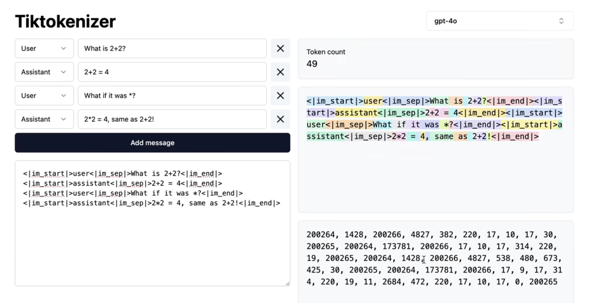
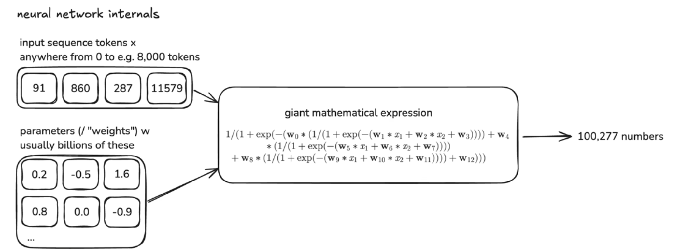
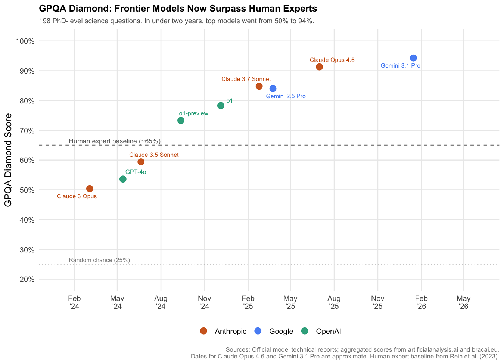
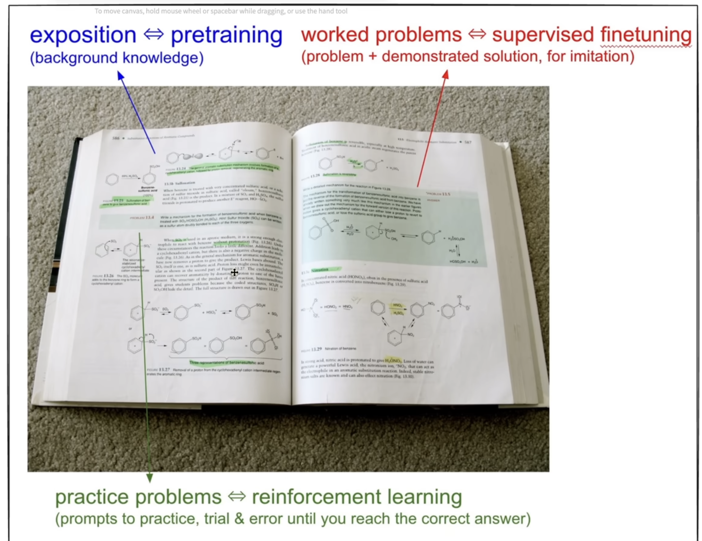
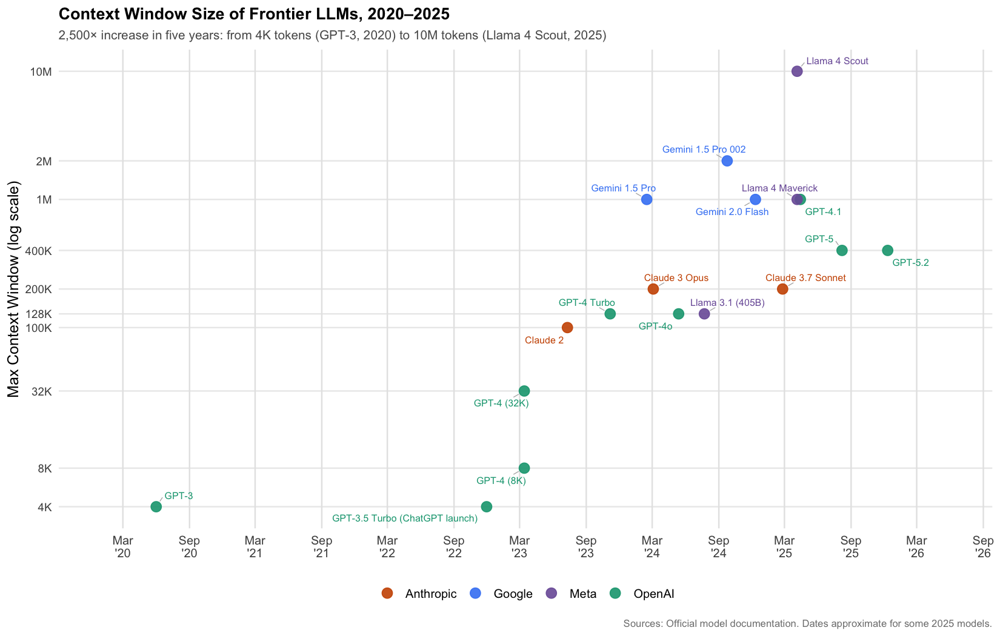
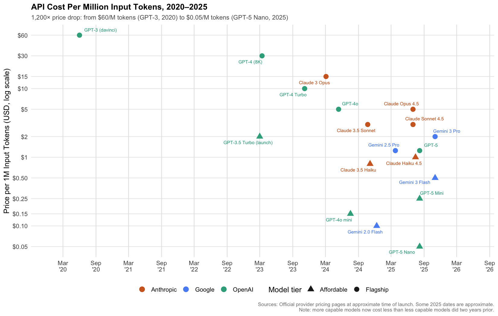

{width=100% fig-align="center"}

## Introduction

In [Part 1](../2026-02-05-AI%20Literacy%20Pt%201/) of this series, I organized AI literacy around four questions:

1. What is AI?
2. What can AI do?
3. **How does AI work?**
4. How can AI be used ethically?

It's not enough to know some high level AI definitions and to explore and experiment with it in a systematic way. If you don't know *how* AI works, you won't use it effectively, and it limits your ability to evaluate it critically. If you have at least a high level understanding of AI architecture, you should be able to explain it to others. That's what I'm trying to model here.

A caveat: in a philosophical sense, it may well be that no one truly knows how AI works! But that doesn't necessarily invalidate AI applications. LLMs are built using machine learning, with neural networks that attempt to mimic--at some relatively rough order of approximation--what is going on in the human brain. But what made me just wander away from the keyboard of my laptop to look out my office window? How did that trigger and influence the sentences I'm writing now? How is all this interacting with the caffeine I consumed 20 minutes ago, and the amount of REM sleep I had last night? I have no idea. And when AlphaGo made its famous "Move 37" in a 2016 Go match against Lee Sedol, a move no human would have predicted, one that seemed like a mistake but was ultimately brilliant, no one could explain how that happened either.

In short, there are clearly levels to how one attempts to answer the question of how AI works. In this post I'm just going to walk us through the basic architecture and call out some useful metaphors. Here's one punchline up front: things are changing at such a rapid pace that it's very hard to support the staying power of authoritative statements about the structural limitations of AI in performing digital tasks that involve the application of knowledge, logic and reasoning.  

### Andrej Karpathy's Deep Dive into LLMs

In February 2025, Andrej Karpathy, former Director of AI at Tesla, a founding member of OpenAI, and one of the clearest communicators in the field, released a 3.5-hour YouTube video titled [*Deep Dive into LLMs like ChatGPT*](https://www.youtube.com/watch?v=7xTGNNLPyMI). It was aimed at a general audience, and, as far as I'm concerned, it's the single best publicly available and intuitively accessible explanation of how modern LLMs are built. Andrej might be most famous for having coined the term "vibe coding" but the guy also has a gift for teaching. From what I understand he is currently working on building "the world's obviously best AI course," and I can't wait to see what he comes up with. In the meantime, this video is the next best thing. 

I'm not going to try to replicate the full 3.5 hours, but I'll walk through the key concepts using Karpathy's framing, his clever metaphors, and some of the better visuals using screenshots from his video. Then I'll point out all that has already changed in the year since he published it.

## The Three-Phase Pipeline of LLM Development

LLM development can be organized into three distinct phases. 

| Phase | Objective | Typical Duration | Scale |
|-------|-----------|-----------------|-------|
| **Pre-training** | Knowledge acquisition | ~3 months | Thousands of GPUs |
| **Supervised Fine-Tuning (SFT)** | Behavioral alignment | ~3 hours | Single node |
| **Reinforcement Learning (RL)** | Emergent reasoning | Variable | High |

: {tbl-colwidths="[35,30,18,17]"}

A quick terminological aside. As I started putting this post together it struck me that the terms pre-training and post-training were confusing to me, because it begs the question, "wait, when does 'training' actually happen?" I asked Claude:

> I'm trying to figure out some confusing terminological distinctions in the phases of creating and deploying an LLM. Karpathy breaks things into two phases: pre-training and post-training with post-training comprised of SFT and RL stages. But this begs the question when does "training happen" (since the two phases are "pre" and "post"). What does and does not constitute "training"?

Claude's response:

> "Pre-training" and "post-training" are named relative to each other historically, not relative to some canonical definition of "training." Both phases involve training in the technical sense. The names are legacy artifacts from how the field evolved.
>
> The historical logic:
>
> "Pre-training" originally meant training a model on a large corpus before fine-tuning it on a specific task — borrowed from transfer learning terminology (BERT, 2018 era). The "pre" meant prior to task-specific adaptation.
>
> As the field matured, "fine-tuning" expanded enormously (SFT, RLHF, etc.) and collectively became "post-training." The original reference point (a downstream task) got lost, and now "pre/post" just means "before/after the base model is ready."

In short, "training" has no stable technical boundary. Indeed, all the phases I will summarize below have the common feature that they lead to a modification of model parameters. Only the first phase is unique in the sense that it provides the initial estimates for the parameters and requires the most data. The pre/post-training distinction is a pipeline convention, not a principled theoretical distinction about what and when the model "learns" from data. In what follows, I try to avoid using the "pre-training" and "post-training" labels and instead focus on what is happening between model and data in each of our three phases.

### Phase I: Building the "Internet Text Simulator"

Before an LLM can do anything useful, it needs to ingest an almost incomprehensible quantity of text. For example, the dataset used to train Meta's open source Llama 3.1 occupied 44 terabytes of disk space. To put this in perspective, if you read at an average pace, Claude tells me it would take you approximately 300,000 years to read the text in that file.

The raw material for an LLM comes primarily from something akin to **Common Crawl**, a publicly available index of billions of web pages. Raw internet text is a minefield of spam, malware, HTML boilerplate, and plenty of things you'd rather not have a model ingest. As Karpathy put it in an interview for the [Dwarkesh podcast](https://www.dwarkesh.com/p/andrej-karpathy), most of what is on the internet is "garbage." Before any machine learning begins, a substantial engineering pipeline runs the data through URL filtering, text extraction, language filtering, and removal of personally identifiable information.

#### Tokenization: From Text to Numbers

LLMs don't process words or characters—they process numbers. Specifically, they process *tokens*, which are chunks of text produced by an algorithm called **Byte Pair Encoding (BPE)**. BPE starts at the level of individual bytes and iteratively merges the most common adjacent pairs into single tokens until it reaches a target vocabulary size. In his video, Karpathy goes through an example of an LLM with a "vocabulary" comprised of 100,277 unique tokens. A rough rule of thumb: one token ≈ ¾ of a word in English.

A great way to see how text gets converted to tokens is to visit the website https://tiktokenizer.vercel.app 

Here's a screenshot example of using tiktokenizer taken from Karpathy's video



A key thing to appreciate is that LLMs don't see the characters of the text you enter into a context window, they see the characters re-expressed as numeric integers. 

#### The Transformer and Next-Token Prediction

The core architecture of every modern LLM is the **Transformer**, introduced in a famous 2017 Google paper entitled "Attention is All You Need". At its core, a Transformer reads a sequence of tokens and asks a single question: *what comes next?* The answer is a probability distribution over every token in the model's vocabulary — the model's best guess, informed by billions of parameters, about what should follow. That's it. The remarkable thing is how much emerges from doing that one thing, repeatedly, at enormous scale. Training consists of adjusting those billions of parameters — essentially "knobs" — so that the model's predictions get closer and closer to what actually appears in the training data.



This is all machine learning using neural networks is doing: **next-token prediction**. Given everything that has come before, what token is most likely to come next? Do this billions of times across trillions of tokens, update the weights after each mistake, and eventually the model builds what Karpathy calls a **"lossy compression of the internet"** inside its parameters. Somewhat miraculously, through its parameters an LLM develops knowledge of grammar, facts, logic, code, and the texture of human reasoning, because all of that structure was latent in the patterns of the text it was trained on.

We can think of the model at this point as a high-powered **"internet text simulator."** It's phenomenally good at completing text in the style of whatever it was trained on. But it has no concept of being useful, honest, or safe. It is, in Karpathy's words, "dreaming remixes of web pages."

I'm skipping over a lot of detail here about transformers, machine learning, neural networks, gradient descent, backpropagation, etc. (I suggest some helpful resources for learning more about these details at the end of this post.) Although I'm also a novice learner when it comes to these technical details, it might be helpful to point out that so-called "data scientists" tend to think of even the classical linear regression model as an instance of supervised machine learning. In a regression context we have independent (predictor) variables that we use to predict a dependent (outcome) variable. We can think of the data we use to estimate the parameters of the regression model as a training set, and then we can attempt to validate the predictions from this training set with new data. Now, since parsimony is a virtue, and because we often want to be able to isolate the partial association or effect of a specific predictor variable on an outcome, the number of parameters in a regression model is typically small-somewhere between 2 and 30. But in machine learning, the goal is not to isolate or interpret the effect of any one predictor variable, but to maximize prediction by any means necessary. Not only is the number of possible unique predictor variables in LLMs huge—defined by the "vocabulary" of unique tokens—but these predictors are allowed to interact with one another in very complicated nonlinear ways through the "layers" of a neural network. So instead of 30 parameters, we can have billions. For a long time, the main impediment to the complexity of these neural networks was computing power. That has changed dramatically over the past decade with the availability of GPUs.

The charts below put the change in scale of these models in perspective. The first shows how the number of parameters in notable AI systems has grown over time. The second shows the relationship between parameter count and training data size.

```{=html}
<iframe src="https://ourworldindata.org/grapher/artificial-intelligence-parameter-count?time=earliest..2025-12-31&tab=chart" loading="lazy" style="width: 100%; height: 600px; border: 0px none;" allow="web-share; clipboard-write"></iframe>
```

```{=html}
<iframe src="https://ourworldindata.org/grapher/parameters-vs-training-dataset-size-in-notable-ai-systems-by-researcher-affiliation?tab=chart" loading="lazy" style="width: 100%; height: 600px; border: 0px none;" allow="web-share; clipboard-write"></iframe>
```

*Source: Epoch AI, 'Parameter, Compute and Data Trends in Machine Learning'. Published online at epochai.org. Retrieved from: 'https://epoch.ai/data/epochdb/visualization'*

One thing worth noticing in the second chart: parameter count and training data have scaled together. This reflects what AI researchers call **scaling laws**, empirical relationships showing that model performance improves predictably as you increase model size and training data in tandem. For much of the history shown in these charts, "more compute + more data = better model" was the operative assumption. But that assumption has recently gotten more complicated because of recent advances in reinforcement learning.

#### A Note on Architecture: Not All Parameters Are Created Equal

In asking for feedback on this section while crafting this post, Claude thought I should add the following:

> Karpathy's video focuses on the "dense" Transformer just described, in which all of a model's parameters are activated for every token it processes. But there's an important architectural wrinkle worth knowing about that his general-audience video doesn't cover: **Mixture of Experts (MoE)**.
>
> MoE models—an active area of research [since at least 2017](https://arxiv.org/abs/1701.06538), and dominant at the frontier since roughly 2023—replace the single large dense network with a collection of smaller specialized "expert" networks, plus a lightweight **router** that decides which experts to activate for each incoming token.
>
> The analogy I find most useful: a dense Transformer is like a hospital where every specialist examines every patient regardless of what's wrong with them. An MoE model is like a hospital with a triage nurse at the front desk—each patient is routed to the two or three specialists most relevant to their condition, while the others remain free for different patients. The total number of specialists (parameters) can be vastly larger, but the cost per patient (compute per token) stays roughly constant.
>
> In practice, a frontier MoE model might have 16 expert subnetworks, with each token routed to just 2. This means you can build a model with, say, 1.7 trillion *total* parameters while activating only around 280 billion for any given forward pass—the knowledge capacity of a massive model at the inference cost of a much smaller one.
>
> Why does this matter for reading the charts above? **Raw parameter counts are not necessarily a valid measure of model size or capability.** When you see a parameter count for a modern frontier model, it may refer to total parameters—only a fraction of which activate for any given token. Keep this caveat in mind.
>
> — *Claude*


### Phase II: Supervised Fine-Tuning — Teaching the Base Model to Be an Assistant through Imitation

What comes out of Phase I of the process described above gets referred to as a *Base Model*. To reiterate, the model at this point is really just a very adept "internet text simulator." To transform it into a useful conversational assistant, we turn to **Supervised Fine-Tuning (SFT)**. The key word is *supervised*: humans provide examples of ideal behavior, and the model is trained to imitate this behavior. 

Organizations like Anthropic, OpenAI, and Google employ teams of expert human labelers to write ideal responses to thousands of carefully designed prompts. These labelers are expected to follow detailed guidelines, often hundreds of pages long, built around three directives: **helpfulness, truthfulness, and harmlessness.** The resulting conversations are formatted into structured templates the model can learn from:

```
[SYSTEM]: You are a helpful assistant.
[USER]: Why is the sky blue?
[ASSISTANT]: The sky appears blue because of a phenomenon called Rayleigh scattering...
```

This is technically still next-token prediction, but the model is now being trained to predict what a careful human labeler would write, rather than what "the internet" would write. The important implication: after SFT, think of your interaction with an LLM as if you were interacting with a **statistical simulation of a human labeler.** 

After SFT, we have a model that is able to emulate and enact next token prediction in a way that maximizes the likelihood that a human on the other end would regard their interaction with it as a "helpful" conversation. 

### Phase III: Reinforcement Learning — Teaching the Model to Reason

This is where things get especially interesting, and where the field has been moving fastest.

In Reinforcement Learning (RL), instead of imitating human-written examples, the model generates many candidate responses to a problem, and those responses are scored (more on this in a moment). Good responses are reinforced; poor ones are discouraged. Over millions of iterations, the model learns strategies that produce better outcomes.

Karpathy emphasizes a crucial distinction between two types of problems:

- **Verifiable domains** (mathematics, coding): there is a ground truth. Code either runs or it doesn't. A proof is either correct or incorrect. You can score model outputs automatically, at scale, without human involvement.
- **Unverifiable domains** (creative writing, summarization): quality is subjective, so it requires human judgement.

Let's start with the scenario of RL in unverifiable domains. 

#### Reinforcement Learning from Human Feedback (RLHF)

Ask your favorite AI chatbot to "write a super funny joke about pelicans." Go ahead and try.

Here's what I got from Claude:

> A pelican walks into a bar. The bartender says, "Why the big bill?"
>
> — *Claude*

Sorry, Claude, that's pretty far from super funny. How was Claude trained to accomplish this? Well, because a joke can't be scored as objectively funny or not funny, what we do instead is repeatedly show humans pairs of jokes Claude has written about pelicans, and then ask which one is funnier. Do this with a thousand unique joke prompts. Use these results to have Claude update its model parameters, so that when a person requests a joke in the future, the parameters most associated with jokes ranked as more funny are weighted more heavily than those ranked as less funny. The idea here goes all the way back to psychophysics in the late 19th century and Thurstone's work on paired comparisons in the 1920s (something I wrote about in my book [Historical and Conceptual Foundations of Measurement in the Human Sciences](https://www.routledge.com/Historical-and-Conceptual-Foundations-of-Measurement-in-the-Human-Sciences-Credos-and-Controversies/Briggs/p/book/9780367225230)). It's easier to ask people to discriminate between two jokes than it is to ask them to generate a funny joke from scratch, or to designate the criteria for what makes a joke funny. To make this scaleable, let's train a separate machine learning model on the initial sample of human pairwise preferences, so that thousands of new jokes can be generated, evaluated and used to continue updating model parameters. It's ingenious.

But there are two big problems. First, we may not be simulating human judgment very well. In theory, that seems like something we can at least check and improve. Second--and this seems like a much bigger problem--there is no guarantee that RLHF will converge to the desired solution. In verifiable domains, we have already discovered that RL can lead to outcomes that are better than what even expert humans could accomplish. Not so in RLHF. According to Karpathy, as you continue over iterations of RLHF, you will eventually encounter adversarial solution paths. Put more simply, the model will start telling you jokes that don't even look like jokes. Because of this, when AI labs do RLHF, they have to run and monitor far fewer model iterations relative to RL with verifiable outcomes, and as a consequence it is never clear (and probably unlikely) that the model has reached an optimal solution to the problem it was given (e.g., learn how to tell funny jokes).  

As a psychometrician, I think of this a little bit like trying to do maximum likelihood estimation with a surface that tends to have a very large portion with only the slightest change of gradient, but lurking throughout are numerous local areas with steep peaks.  Humor is extremely subjective, culturally loaded, and tough to capture in writing. Is it any surprise that when asking Claude to simulate humor, we are likely to get the lowest common denominator from the rankings it has seen, and as such that what emerges is unlikely to be any better than a bad dad joke? 

But all is not lost. Because it may well be the case that the best way to become funny is to get really good at math and coding. Yes, my psychometrician friends, there is hope for you yet.

#### Reinforcement Learning in Verifiable Domains: The Emergence of Chain of Thought Reasoning

We already knew that incredible things were possible when RL techniques were applied in game settings such as chess and Go. I've already referenced the magic of "Move 37" by Deepmind's [AlphaGo](https://www.youtube.com/watch?v=WXuK6gekU1Y&t=5249s) (Seriously, if you haven't see the documentary, check it out). But something just as remarkable happened when researchers applied RL with LLMs on verifiable reasoning tasks: models *discovered* that they performed better when they used more tokens to think through a problem before answering. This emerged from the optimization process. Models like OpenAI's o1 (released September 12, 2024) and DeepSeek-R1 (released January 20, 2025--right before Karpathy's video deep dive) developed an internal monologue in which they would pause, backtrack, and re-examine their reasoning before committing to an answer. You can see this firsthand anytime you invoke Claude, ChatGPT or Gemini in "thinking mode." The text that flashes in front of you looks a lot like deliberate thought. (The DeepSeek release also came with an influential research article "Incentivizing Reasoning Capabilities in LLMs via Reinforcement Learning" that a little over a year later has been cited about 8000 times.)

This is the phenomenon behind **Chain of Thought (CoT)** reasoning. Each intermediate step gives the model additional context for predicting the next token, which is why thinking "out loud" improves performance on complex tasks. 

The GPQA Diamond benchmark offers a striking illustration of what RL-driven reasoning has done for performance on genuinely hard problems. GPQA Diamond consists of 198 PhD-level science questions that are specifically designed to be "Google-proof," the kind of question where looking up the answer won't help unless you can also understand it. Random guessing gives you 25%. The human expert baseline—people with PhDs in the relevant fields—is around 70%.



In under two years, top models went from barely clearing random chance to substantially exceeding human expert performance.

Here's what we don't know: can the changes to model parameters that happen when training these models in verifiable domains lead to the "discovery" of a recipe for telling a banger of a joke on demand?

Probably not? Interestingly, in an interview on the [Dwarkesh podcast](https://www.dwarkesh.com/p/andrej-karpathy), Karpathy memorably says "RL is terrible...you're essentially sucking supervision through a straw." He elaborates by pointing out how crude the information is that gets provided to models in RL. The model can only learn that certain strategies lead to a correct answer, and this leads to the upweighting of all the parameters invoked on the solution path, even if there were (corrected) mistakes and inefficient decisions made along the way. We can be sure that making RL more efficient and informative is currently a very active area of research and innovation at the major AI labs.

### The Textbook Analogy

The picture below is one of the best analogies in Karpathy's video for distinguishing what is happening in the three phases of LLM development.

{width=70%}

Think of an old-school math or science textbook. Each chapter is usually a mix of (1) exposition about the content, (2) examples that demonstrate how the content is to be invoked to solve a problem ("worked problems"), and (3) sets of practice problems that have a solution in the back of the book, but don't provide the steps needed to get to the solution. Estimating the parameters of the model from internet text (i.e., "pre-training") is analogous to the exposition in a textbook; it provides the model with background knowledge. Updating the model parameters using SFT is like studying worked problems--the model is learning by example. Updating the model via RL is analogous to the generalization and transfer that we hope will come from figuring out how to answer a problem correctly when the steps haven't been given to us in advance.

### Are LLMs Like Swiss Cheese?  

Karpathy concludes that we should think of LLMs the way we think of  Swiss Cheese. Very good but beware of the holes. Brilliant at PhD-level physics, inexplicably bad at elementary tasks. He illustrated this with two somewhat famous examples.

**Token-level errors.** Because the model operates on tokens rather than characters, it can't "see" individual letters the way a human reader does. The canonical example was asking a model how many *r*'s are in the word "strawberry"—a question that tripped up GPT-4 and Claude 3 reliably, because they had no mechanism for character-level inspection.

**Simple math.** Many models claimed that 9.11 is larger than 9.9, apparently because "9:11" appears after "9.9" in book chapter numbering (e.g., think of the way the Bible is organized numerically).

But here is the thing: **frontier models in 2026 largely get these right.** Go ahead and ask your favorite chatbot how many *r*'s are in "strawberry." Or ask it to count the letters in "supercalifragilisticexpialidocious." GPT-5.2 gets it right. So does Claude Opus 4.6. The 9.11 vs. 9.9 comparison is handled correctly by current frontier models as well. 

The most consequential and well-known hole in the Swiss Cheese model is for models to produce **hallucinations**. Models are trained to produce confident, fluent text, because their labelers produced confident, fluent text. Unless it is an explicit part of its training, when a model lacks strong statistical signal for something, it doesn't say "I don't know," it generates a plausible-sounding completion that can look exactly like accurate information. In [Part 2](../2026-02-20-26_AI%20Literacy%20Pt%202/) of this blog post series I gave some examples of how this happened in a few recent collaborations with Claude Code.

## The ChatGPT Experience of 2023-24 is Ancient History

### Increases to In-context Learning (ICL) Capabilities

The partial solution to hallucinations and to the broader limitations of parametric knowledge in LLMs was already visible in Karpathy's video with the distinction he drew between knowledge stored in a model's **parameters** (vague, probabilistic, frozen at training time) versus knowledge present in the **context window** (precise, current, directly accessible). Another one of his great analogies is that we should think of the parameters of an LLM as akin to our long-term memory, and the context-window as akin to our working memory. I've read the text I assign to my students for my classes many, many times. But I'm much better able to discuss the text with students in class by doing a quick re-read a few days before. It's more readily accessible in my working memory.

The improvement of a model's reasoning and responses as a function of the tokens loaded into its context window is to me, and I think also to AI experts, still something that is equal parts miracle and mystery. Strictly speaking, when we upload documents, articles or exemplars (i.e., "shots") in a model's context window, we are not training the model, because nothing we are doing is changing the model's parameters. But it sure seems like the model has learned something important, because the difference in the quality and accuracy of model responses is obvious. As such, we refer to this as a model's ability at **in-context learning**. 

The ability of a model to do in-context learning by holding an entire book—or an entire codebase—in its working memory is no small thing. It unlocks a qualitative change in the kinds of tasks you can reasonably expect a model to complete with accuracy. And this is getting better because the size of context windows has been growing over time, as the plot below shows.



This importance of ICL underlies two of the most important developments in today's AI systems. 

### Retrieval-Augmented Generation (RAG)

Rather than asking a model to answer a question from its training data alone, a RAG system first retrieves relevant documents from an external corpus—a website, a company's internal knowledge base, a medical literature database, a legal document repository—and inserts them into the model's context window before generating a response. The model then reasons over documents it may not have been trained on, with access to information that is current, domain-specific, and verifiable. All the major frontier models now come with RAG capability.

### Tool Use

Modern frontier models can call external tools mid-conversation: web search, code execution, calculators, database queries, file reading. When a model executes a Python snippet to verify a calculation, or queries a search engine before answering a factual question, it is substituting a deterministic, verifiable result for a probabilistic guess. The arithmetic errors and knowledge cutoff problems that plagued early LLMs are largely addressed this way—not by making the model's parametric memory more accurate, but by giving it access to accurate external sources on demand. 

The combination of tool use and RAG has shifted what hallucination looks like in practice. There are fewer cases in which the model confidently invents a plausible-sounding fact. Instead, the model may be acting upon information from a retrieved document (that I uploaded into the context window) that is itself incorrect, it may misinterpret an ambiguous search result, or it may over-rely on a tool without recognizing that the tool returned something incomplete. The Swiss Cheese holes are still there, but they've gotten smaller and more irregular. In Karpathy's deep dive, it was still sometimes necessary to instruct ChatGPT 4.0 to use tools to perform an analysis like counting dots or letters. With the advent of CoT reasoning, the best AI models are now quite good at knowing when it is prudent to invoke tools as a function of the kind of prompt they have received.

When you engage the extended thinking models in Claude, ChatGPT or Gemini what you see is genuinely interesting: the model backtracking, catching its own errors, considering and discarding approaches. Whether that constitutes "thinking" in any philosophically meaningful sense is a question I'll leave for another time. But empirically, models that spend more tokens "thinking" produce better answers on hard problems.

### From Chatbots to Agents

The last item on Karpathy's checklist for the future is now all the way here—agentic AI. As I described in [Part 2](../2026-02-20-26_AI%20Literacy%20Pt%202/), Claude Code is not a chatbot that helps you write code. It's an agent that can read your file system, execute commands, catch errors, and iterate autonomously until the task is done or it runs into something it can't resolve. It's vibe coding on steroids. Here is what Karpathy posted on the application formerly known as Twitter, just about one year since releasing his LLM deep dive video.

> "It is hard to communicate how much programming has changed due to AI in the last 2 months: not gradually and over time in the ‘progress as usual’ way, but specifically this last December. There are a number of asterisks but imo coding agents basically didn’t work before December and basically work since - the models have significantly higher quality, long-term coherence and tenacity and they can power through large and long tasks, well past enough that it is extremely disruptive to the default programming workflow...
>
> As a result, programming is becoming unrecognizable. You’re not typing computer code into an editor like the way things were since computers were invented, that era is over. You’re spinning up AI agents, giving them tasks *in English* and managing and reviewing their work in parallel. The biggest prize is in figuring out how you can keep ascending the layers of abstraction to set up long-running orchestrator Claws with all of the right tools, memory and instructions that productively manage multiple parallel Code instances for you. The leverage achievable via top tier ‘agentic engineering’ feels very high right now.
>
> It’s not perfect, it needs high-level direction, judgement, taste, oversight, iteration and hints and ideas. It works a lot better in some scenarios than others (e.g. especially for tasks that are well-specified and where you can verify/test functionality). The key is to build intuition to decompose the task just right to hand off the parts that work and help out around the edges. But imo, this is nowhere near ‘business as usual’ time in software."
>
> — *Andrej Karpathy, X (February 25, 2026)*

### How Soon Will I Need to Update this Post?

The cost of accessing frontier models via API has dropped dramatically, as the chart below illustrates.



From \$60 per million input tokens (GPT-3, 2020) to \$0.05 per million tokens (GPT-5 Nano, 2025). In five years. For products that are dramatically more capable at every price point. 

Pre-training is expensive and slow—months of compute, tens or hundreds of millions of dollars. But it is, in some sense, a solved problem: you have enough text, you have enough GPUs, and the procedure is well understood. Much of the competitive frontier has shifted to the SFT and RL phases and to innovations in how RL is used, and this frontier will surely change fast.

## Summary


I asked Claude to give a final summary of the ground that we've covered.

>The infographic above (created within Google's NotebookLM) captures the core architecture. But the deeper point of this post is what that architecture implies.
>
>An LLM is not a database, a search engine, or a calculator. It is a statistical simulator of human-generated text, first trained to model the internet, then shaped by human feedback to behave like a careful, helpful labeler, then pushed further by reinforcement learning to discover reasoning strategies no one explicitly programmed. The result is something that sits in an uncomfortable conceptual space: not intelligent in any philosophically meaningful sense, but capable of outputs that are, in many domains, better than what humans produce.
>
>The Swiss Cheese metaphor is still apt — but the cheese is getting denser. The token-level errors and arithmetic failures that were reliable gotchas for GPT-4 and early Claude are largely gone. Hallucinations, the more consequential hole, are shrinking too, as tool use and retrieval bring verifiable information directly into the context window. The frontier of 2026 is not the ChatGPT of 2023.
>
>What hasn't changed is the underlying pace. Karpathy made his deep dive video one year ago and it is already partly a historical document. The cost chart alone — $60 per million tokens to $0.05 in five years — tells you something about the trajectory. If you're trying to form stable views about what AI can and can't do, the half-life of those views is short. The best defense is not a fixed list of limitations, but a working model of *how* the thing is built — which is what this post has tried to give you.

Thanks Claude, well said. 

In part 4 of this series I will turn to the question of how we can use AI ethically. And boy oh boy is this ever the time to be grappling with that question...

## Resources

- [Andrej Karpathy: Deep Dive into LLMs like ChatGPT (YouTube)](https://www.youtube.com/watch?v=7xTGNNLPyMI) — the best 3.5 hours you can spend on this topic
- [3Blue1Brown: Neural Networks (YouTube playlist)](https://www.youtube.com/playlist?list=PLZHQObOWTQDNU6R1_67000Dx_ZCJB-3pi) — visually intuitive introduction to how neural networks and backpropagation actually work
- [Financial Times: Generative AI — How the Transformer Works](https://ig.ft.com/generative-ai/) — an interactive visualization of the Transformer architecture
- [Epoch AI: Trends in Machine Learning](https://epoch.ai/trends) — the most comprehensive data source for tracking model size, compute, and training data over time
- [Our World in Data: Parameters in Notable AI Systems](https://ourworldindata.org/grapher/artificial-intelligence-parameter-count) — accessible visualization of the scaling story
- [Artificial Analysis LLM Leaderboard](https://artificialanalysis.ai/leaderboards/models) — current benchmark comparisons across all major models
- [DeepSeek-R1: Incentivizing Reasoning Capabilities in LLMs via Reinforcement Learning](https://arxiv.org/abs/2501.12948) — the paper behind the model that upended cost assumptions
- [Attention is All You Need](https://arxiv.org/abs/1706.03762) — Vaswani et al. (2017), the original Transformer paper
- [Outrageously Large Neural Networks: The Sparsely-Gated Mixture-of-Experts Layer](https://arxiv.org/abs/1701.06538) — Shazeer et al. (2017), the foundational MoE paper
- [Switch Transformers](https://arxiv.org/abs/2101.03961) — Fedus et al. (2021), bringing MoE to the Transformer era at scale
- [Mixture of Experts Explained](https://huggingface.co/blog/moe) — Hugging Face (2023), the most accessible technical explainer
