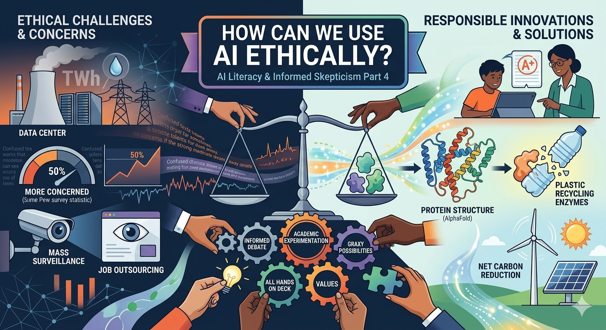
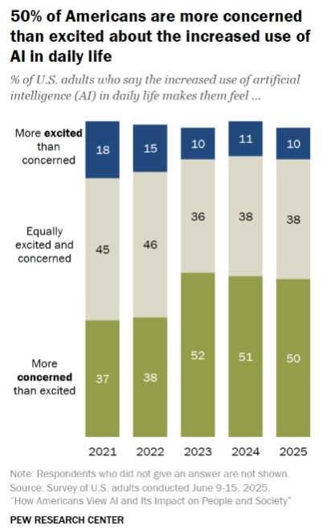
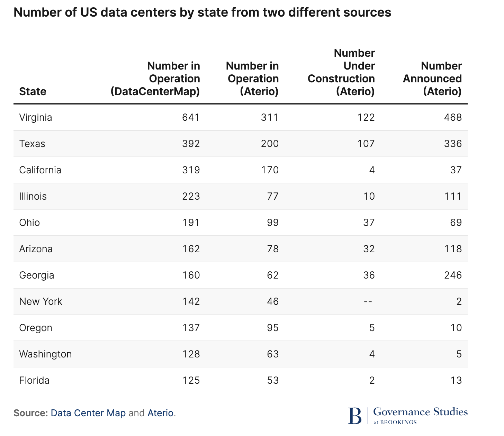
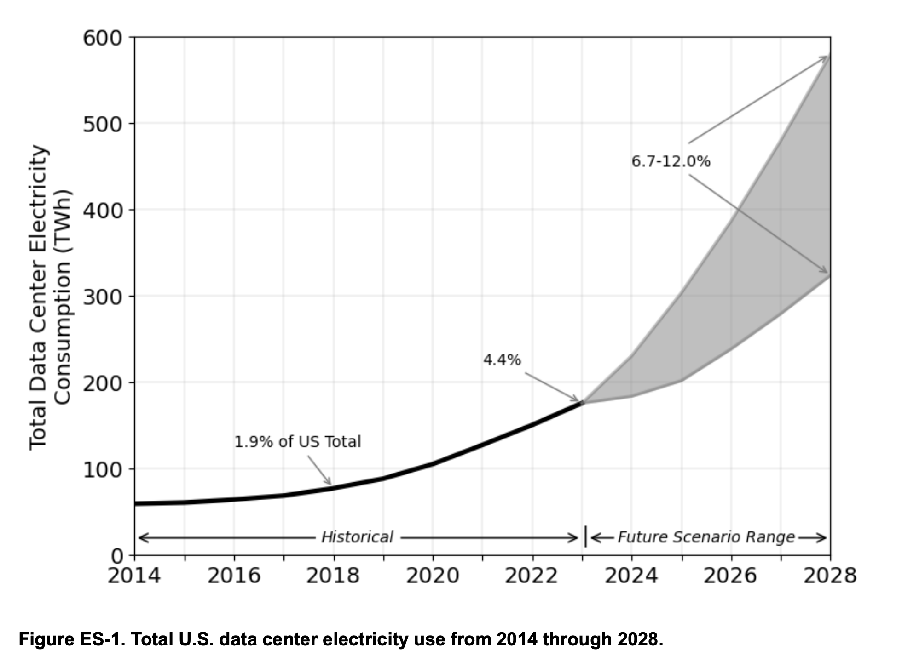
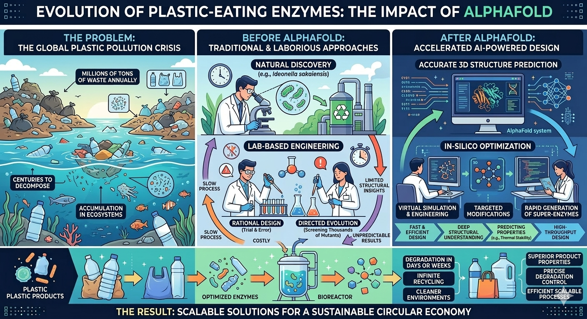
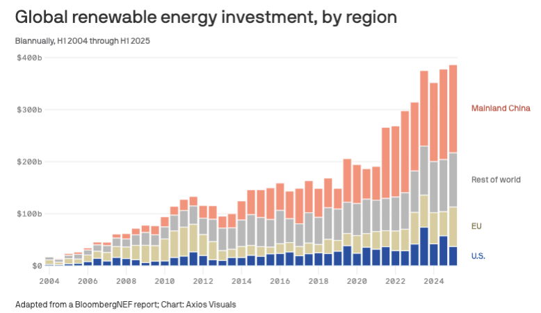

{width=100% fig-align="center"}

In the past three blog entries in this series, we've covered how to [define AI](../2026-02-05-AI%20Literacy%20Pt%201/), use cases of what generative [AI can do](../2026-02-20-26_AI%20Literacy%20Pt%202/) (and the importance of critically evaluating what gets done), and we've gone through a high-level deconstruction of [how AI works](../2026-03-05_AI%20Literacy%20Pt%203/). This last entry has taken me longer than the others to craft because it's the most controversial, and it's the one where my own perspectives are in the greatest state of flux.

I mean, right from the start it isn't clear if I'm asking the right question. I think others might prefer to ask how we can use AI *responsibly*. As just one example, in the educational measurement world, researchers involved with the [Duolingo English Test](https://duolingo-papers.s3.us-east-1.amazonaws.com/other/Duolingo+English+Test+Responsible+AI.pdf) have done a lot of good in fostering [discussion and debate](https://journals.sagepub.com/doi/full/10.3102/10769986241276424) about standards for "responsible" AI use in test development, analysis and administration.

There's a lot to be said for this responsibility framing as it immediately directs us to the need for someone or some group to be accountable for the actions and consequences of AI. Still, I prefer to call out ethics directly because it invites us to recognize that unlike other fairly recent technological innovations---personal computers, the internet, smartphones---the societal stakes related to generative AI just feel... different. Let's define ethics.

> Ethics is the philosophical study of moral phenomena...it investigates normative questions about what people ought to do...it examines what obligations people have, what behavior is right and wrong, and how to lead a good life. As a rational and systematic field of inquiry, ethics studies practical reasons why people should act one way rather than another. --- [Wikipedia](https://en.wikipedia.org/wiki/Ethics)

In short, addressing the question of how AI can be used ethically means taking a position about what seems "right" and what seems "wrong" after grappling between different possibilities and perspectives, between costs and benefits. Importantly, it also means making a commitment to rational and systematic inquiry, and the results of such inquiries can lead to different conclusions. This means that the positions I take today on ethical AI usage may not be the position I take next year.

## The AI Backlash

In the United States, I see an AI backlash [gathering steam](https://poll.qu.edu/poll-release?releaseid=3955). The title of the release of a new Quinnipiac poll on AI views of Americans reads " Americans' AI Use Increases While Views On It Sour." A big part of the problem here is the obvious need for a federal government that can enact sensible regulations on AI development and use--74% of Americans think the government is not doing enough to regulate the use of AI. But sensible regulation seems pretty far out of reach given our present state of dysfunction and polarization. So, it's hardly surprising to find that when Americans were asked in a national [Pew Research Survey](https://www.pewresearch.org/short-reads/2026/03/12/key-findings-about-how-americans-view-artificial-intelligence/) whether the increased use of AI in daily life makes them feel more/less/equally excited than concerned, only 10% of respondents say that they are more excited than they are concerned, with 50% saying they are more concerned than excited.

{width=50% fig-align="center"}

And who can blame them when one of the best-case scenarios for the impact of AI on society is that in the long run, yes, we might be able to use AI to cure cancer and combat climate change, but in the more immediate short run, a gloomy data center is coming to your county and your job is set to be outsourced to ChatGPT. And the worst-case scenarios? Those include mass surveillance in a dystopian state, or even full-scale extinction of the human race. The best- and worst-case scenarios are asymmetric. And fear is a much more visceral motivation than hope. On the one hand we have an AI-powered robot looking like Arnold Schwarzenegger in the Terminator movies. On the other we have Demis Hassabis leveraging AI to solve the protein folding problem. 

## All Hands on Deck

There are some heavy ethical issues about AI development we need to be debating, much of which falls under the heading of the "alignment problem."

1. Are there universally accepted human values?
2. To what extent can an AI system be safely aligned with human values?
3. Does alignment happen by establishing general principles, specific rules, or some combination of the two?
4. Who gets to decide on the AI vs. human value alignment process?
5. Should an AI agent take the world as it is or take the world as some human or group of humans wants it to be?

There are a lot of smart people working at the frontier AI labs who are [actively involved with these issues](https://www.newyorker.com/magazine/2026/02/16/what-is-claude-anthropic-doesnt-know-either). But that's not enough. We need people from all walks of life to be actively exploring and experimenting with AI so that they can contribute knowledgeably to an important societal debate. We need all hands on deck.

What worries me is this: I interact with a lot of highly educated (by definition) faculty in academia both at the University of Colorado and other professional gatherings. And it's stunning to me how few people are experimenting with AI when they are so well-positioned to do so. As I argued in my [second post](../2026-02-20-26_AI%20Literacy%20Pt%202/) in this series, the best way to discover what AI can---and what it can't do, at least at a given point in time---is to experiment with it in domains where you have some baseline level of expertise. University and college faculty all have domain expertise, and they exercise it daily as part of their research, teaching and service activities. Most of the activities tend to repeat a lot of the same patterns. For example, literature review and data analysis are invariably part of most research projects; lectures, small group activities are invariably part of teaching. How do these activities change when we invite AI to the table? It's a pretty low cost within-person experiment, provided you can overcome the initial hurdle of learning some good prompt engineering techniques.

With all that I've written above as backdrop, what I've found surprising is just how many colleagues I've heard say something to the effect of "OK, I get that AI isn't going anywhere and I'm going to have to come to terms with this, but I'm deeply concerned that the more we use AI, the greater the impact this will have on our already precarious supply of energy and water. How can we reconcile a concern for the environment with a world in which AI usage becomes unavoidable?"

Let's dig into this. Not just because it's an important question on its own terms, but because I think it illustrates what ethical reasoning about AI looks like in practice. You have to go find the evidence, put big numbers in proper context, and weigh costs against benefits. Let me try to model that here.

## Data Centers by the Numbers

According to a Brookings Institution report, ["The Future of Data Centers,"](https://www.brookings.edu/articles/the-future-of-data-centers/) as of November 2025 there were an estimated 11,800 data centers in the world, and 45% (5,426) of them are located in the United States. The table below shows the 11 states with the largest number of data centers.

{width=60% fig-align="center"}

A report from Lawrence Berkeley Labs shows that the electricity consumed by data centers has indeed begun to increase noticeably since 2018.

{width=80% fig-align="center"}

A quick side note: energy in the Lawrence Berkeley report is measured in terawatt-hours (TWh), where one TWh equals one trillion watt-hours. For perspective, a typical US household consumes about 10,500 kilowatt-hours (kWh) per year.

Data center electricity consumption in the US has more than doubled from 2018 to 2023, going from 76 to 176 TWh. As a proportion of the total energy consumed in the US, the 2023 amount is the equivalent of the energy consumed by about 17 million homes. This seems (and is) quite substantial. But as a percentage of total energy consumption in the US it remains relatively small---just 4.4% in 2023. As AI usage expands and more data centers come online, this percentage is predicted to reach somewhere between 6.7 and 12.0% by 2028.

It is harder to get reliable data on data center water consumption. According to a [New York Times investigation](https://www.nytimes.com/2025/07/14/technology/meta-data-center-water.html), the newest data centers built to support frontier AI models could require millions of gallons of water a day. That seems like a lot of water. [Brian Potter](https://www.construction-physics.com/p/i-was-wrong-about-data-center-water) estimates that across all data centers in the US in 2023, daily water use is between 200 and 250 million gallons per day. A lot of water! But it does beg the question: how much total water gets consumed in the US on a daily basis? A [careful analysis](https://hess.copernicus.org/articles/22/3007/2018/) published in 2018 puts this number at 132 billion gallons per day. A LOT of water. How about some arithmetic: 250 million divided by 132 billion is .0019.

In short, what the numbers tell us is that yes, data centers in the US require a substantial amount of energy and water and these needs are going to increase in the coming years. But they also tell us that relative to total energy and water consumption, these big numbers are pretty small proportions of much bigger numbers.

One thing none of these numbers capture is how many people/organizations are being served by the data that gets generated in data centers, and what is being done with this data. So, bear with me while I tell you a little story about plastics, pollution, proteins and the triumph of one of the most brilliant nerds on our planet, Demis Hassabis.

## Plastics

Given what we know today, it might seem hard to believe that there was a time when plastics were regarded with near universal enthusiasm. Before plastics, a lot of consumer goods depended on scarce natural materials like metals, ivory, silk and rubber. Plastics were this "alchemical" substance that could be morphed into seemingly all possible shapes and sizes, and could be affordable to the working class. Production of nylon, polyethylene, polystyrene and PVC all scaled up during and after World War II, and a young Dustin Hoffman (in the 1967 movie *The Graduate*) was told that the key to his future was one word, ["plastics."](https://www.youtube.com/watch?v=2DJato7gzKE)

Today, it's safe to say that for all their benefits of convenience and affordability, plastics are a major environmental problem. As of 2023, global plastic production reached 436 million metric tons, up from 2 million metric tons in 1950, an 8.4% annual growth rate over seven decades. About 75-80% of this production has ended up in landfills or dispersed throughout natural ecosystems, perhaps most visibly in the ocean.

Like me, you probably do your part by limiting consumption of single-use plastics whenever possible. I use my aluminum Hydro Flask for drinking water and my family dutifully places the plastics we can't seem to avoid as part of our groceries into the recycling bin Western Disposal comes to pick up once every two weeks. Unfortunately, this personal responsibility only takes us so far: the global recycling rate for plastic is under 10%, and in the US it is only about 5%. Why? Because even though the goods we purchase in plastic containers tend to come with symbols suggesting they can be recycled, most plastics are only [recyclable in theory, not in practice](https://thesustainableagency.com/blog/recycling-facts-and-statistics/).

If the status quo continues---where it is cheaper to dispose of plastic waste by burning or burying it than it is to try to recycle, and when it is cheaper for companies to purchase new plastics instead of recycled plastics---the problem of plastic pollution in the environment is likely to continue to worsen. Annual production of plastic is predicted to double by the year 2050.

Addressing this environmental problem is going to require a change in both societal habits of consumption as well as a change to the economic realities of recycling. And this is going to require scientific innovation, because plastic recycling will only become widespread if it can be done more efficiently, and to make a dent, this is going to have to happen at scale.

## Protein Folding

In 2016, Japanese researchers discovered a bacterium called *Ideonella sakaiensis* that uses PET as its main energy source and secretes an enzyme called PETase which can degrade PET into small molecules in days. Unfortunately, natural PETase has low efficiency at the temperatures where PET becomes the most pliable (when heated to 60--65 degrees Celsius, 140--150 Fahrenheit), a limitation to its practical application in plastic recycling. The scientific challenge: can we discover or engineer a new enzyme that can overcome this limitation?

Now, until a few months ago, I had never heard of protein folding. But then I happened upon the documentary *A Thinking Game* on a flight from Denver to Washington DC in November of 2025. That documentary tells the story of how Google DeepMind, under the leadership of Demis Hassabis, built an AI system called AlphaFold that solved the protein folding problem in 2020.

(Since this is a bit far outside my comfort zone to paraphrase, I asked Gemini 3.1 Pro to "explain the protein folding problem that AlphaFold was able to solve in a way that would be accessible to someone who has a college education but hasn't taken Chemistry or Biology since high school.")

> **The Basics: What is a Protein?**
>
> Think of your body as a bustling, microscopic city. Proteins are the physical machines, vehicles, and workers that keep the city running. They digest your food, flex your muscles, and fight off viruses.
>
> Every protein starts its life as a long, straight chain of chemicals called amino acids. You can think of this like a string of different colored beads, or a sentence made up of 20 different letters (since there are 20 standard amino acids). Your DNA is simply the instruction manual that tells your cells what order to string the beads in.
>
> **The "Folding" Part: Shape Equals Function**
>
> Here is the catch: a straight string of beads can't do any work. To become a functional machine, that string has to crumple, twist, and fold itself into a highly specific 3D shape.
>
> - *The Lock and Key:* A protein's final 3D shape determines exactly what it does. For example, an antibody protein that fights COVID-19 folds into a specific "cap" shape that perfectly locks onto the virus's spikes.
> - *The Stakes:* If a protein folds incorrectly, it is useless. In fact, misfolded proteins are the root cause of many severe diseases, including Alzheimer's and Parkinson's.
>
> **The "Problem": Astronomical Possibilities**
>
> For over 50 years, scientists could easily read the DNA "instruction manual" to see the exact sequence of the beads. But they couldn't predict the final 3D origami shape those beads would take. This was the protein folding problem.
>
> Why was it so hard? Because a single string of amino acids can fold in an almost infinite number of ways. A famous calculation in the 1960s estimated that a typical protein has about 10 to the 300th power possible shapes it could take (that is a 1 followed by 300 zeros).
>
> If a supercomputer tried to figure out the shape by testing every possible physical fold, it would take longer than the lifespan of the universe just to solve one protein. Yet, somehow, a protein inside your body naturally folds into its exact, correct shape in mere milliseconds.
>
> **The Solution: How AlphaFold Cracked the Code**
>
> Because computers couldn't simulate the physics, scientists had to use incredibly slow, expensive physical experiments (like X-ray crystallography) to figure out protein shapes in a lab. It would often take a PhD student up to five years and $100,000 to determine the shape of a single protein.
>
> Then, Google DeepMind created AlphaFold. Instead of trying to simulate the physical pushing and pulling of every single atom (the brute-force approach), AlphaFold used Artificial Intelligence and pattern recognition.
>
> - *Learning from the past:* The AI was fed the massive database of the roughly 170,000 protein structures that scientists had painstakingly solved over the previous decades.
> - *Connecting the dots:* AlphaFold's deep learning algorithms looked at the 1D sequences and their final 3D shapes, and learned to spot incredibly complex evolutionary and spatial rules. It learned how certain "beads" almost always ended up next to other "beads" in 3D space, even if they were far apart on the initial string.
> - *The Result:* AlphaFold learned to look at a brand-new, never-before-seen string of amino acids and instantly predict its final 3D shape with near-perfect, atomic accuracy. What used to take years could suddenly be done on a computer in minutes.
>
> **Why It's a Massive Deal**
>
> AlphaFold basically gave humanity a Google Earth map of biology. It has now predicted the shapes of over 200 million proteins---nearly every protein known to science. Furthermore, the newest version (AlphaFold 3) can now predict how these proteins interact with DNA, RNA, and potential drug molecules.
>
> By solving this problem, AlphaFold allows researchers to fast-track life-saving medicines, design completely new enzymes that can eat plastic pollution, and understand the fundamental building blocks of life at a pace that was unimaginable just a decade ago.
>
> --- *Gemini*

I then asked Gemini to develop an infographic to show the way that AlphaFold has led to innovations that have the potential for real-world impact on plastic recycling:

This is exciting stuff, and it isn't all hypothetical. The French company [Carbios](https://www.carbios.com/en/) and the American startup [Protein Evolution](https://www.forbes.com/sites/amyfeldman/2024/05/03/this-startups-ai-designs-enzymes-that-can-eat-plastic-waste/) have leveraged the insights on protein structures from AlphaFold to develop enzymes that specifically depolymerize PET back into its original monomers, enabling production of 100% recycled PET without loss of quality. Their first commercial plants will have a processing capacity of 50,000 tonnes per year of post-consumer PET waste, including waste that can't be mechanically recycled---colored, multi-layered, and opaque PET.

Now, as Claude would be the first to tell you (because I asked), there are a lot of caveats to this AI-fueled success story.

- The enzymatic approach only works for PET, and PET is only 6-8% of plastic production.
- A company like Carbios is only projected to be able to process 50,000 tons a year, but global PET waste is about 50-70 million tons a year.
- The approach requires significant energy, and it is costly to establish.

Nonetheless, this offers a compelling example of the way that AI as a technology can have a concrete, positive environmental impact. And this is just one example of an innovation and application spurred by AlphaFold. I could have just as well told similar stories in regard to the development of crops that will be better able to adapt to climate change, or new efforts to understand and cure diseases. See for yourself at <https://deepmind.google/science/alphafold/>.

To be fair, I'll acknowledge that the AlphaFold example is not a success story for generative AI and LLMs, as it is based on specialized machine learning focused on classification with verifiable outcomes. But if you watch *A Thinking Game*, it is obvious that Hassabis viewed AlphaFold (as well as AlphaGo and AlphaZero before that) as having auxiliary benefits toward the grander ambition to develop Artificial General Intelligence, and you can see clips throughout the documentary of DeepMind's work developing and furthering generative AI via large language models. And generative AI is already contributing to scientific discovery in its own right. In late 2023, DeepMind's FunSearch used an LLM to discover new solutions to open problems in combinatorial mathematics---results published in *Nature* that represented genuinely novel mathematical knowledge, not just recombination of existing results. You don't have to dig too hard to see how initially skeptical scientists have changed their tunes about the capability of LLMs to grease the wheels of scientific discovery (see [this Scientific American article](https://www.scientificamerican.com/article/as-ai-keeps-improving-mathematicians-struggle-to-foretell-their-own-future/) and [this blog post by Daniel Litt](https://www.daniellitt.com/blog/2026/2/20/mathematics-in-the-library-of-babel)).

**Bottom line:** if you aren't willing to acknowledge that AI doesn't just have the *potential* to help us solve major problems in the world, but that in existing scientific domains this is already happening, then you are not approaching the topic in an informed way, or you aren't approaching it in good faith.

## Data Centers and Environmental Impact

A lot of the media coverage I've read related to concerns about AI and environment seem to be intentionally sensationalistic (especially the headlines). Put to the side for the moment how we should properly gauge the costs of AI in terms of environmental impact. It is extremely rare for any of these stories to give anywhere close to equal billing to actual benefits stemming from AI, and by extension, the data centers that have powered all kinds of AI and computing innovations well before ChatGPT changed the world. I can't stress this point enough. I read the newspaper every morning. I pay attention to current events. How is it possible that I had never heard of AlphaFold---something that happened in 2020---until I stumbled upon *A Thinking Game* in 2025? Had you heard about any of this before reading this blog?

Let's turn back to the costs of AI with regard to energy and water usage. If I can have one positive impact on you today, it will be to point you in the direction of [Andy Masley's writing about AI and the environment](https://blog.andymasley.com/p/ai-and-the-environment), which I find extremely compelling. I suppose I could end this section of my post right here and just say: go read Andy Masley's blog!

But since I have your attention, let me summarize Masley's core argument.

His central point is about scale. When you include all the hidden costs---training runs, hardware manufacturing, cooling, idle chips---the carbon cost of an average chatbot prompt still adds up to less than 1/150,000th of the average American's daily emissions. Water is similar: the average American's daily water footprint is roughly 800,000 times the full cost of a single AI prompt.

So why do the aggregate numbers for data centers look so alarming? Because data centers concentrate an enormous number of individually tiny tasks into a single physical place. It's the same reason a stadium draws more power from the local grid than a coffee shop---it's serving vastly more people at once. Globally, the average person spends 7 hours a day online, yet data centers consume only 0.23% of the world's energy. The reason AI is rapidly using more energy is that AI is suddenly being used by more people, not that any individual's usage is particularly costly.

This leads Masley to the argument I find most important: the vast majority of AI's effects on the environment will come from *how it's used*, not from the energy cost of running it. No one evaluates Google Maps' climate impact by asking about the electricity its data centers consume---what matters is whether it reduces driving or encourages more of it. The same logic applies to AI. As Masley puts it, "Deciding that you're going to stop using AI for the sake of the climate is like going around your home and randomly unscrewing a single LED bulb, or pausing your microwave a few seconds early to save the planet. It's so small that it's a meaningless distraction."

Now, I find Masley's argument compelling, but that doesn't mean its beyond reproach.

First, the per-prompt framing is rhetorically powerful but it can also be a bit of a sleight of hand. Any *individual* act of consumption is negligible relative to an entire society's footprint---that's as true of driving a car or eating a hamburger as it is of running an AI query. The harder question is whether the *system* is being built sustainably, and per-prompt accounting doesn't really address that. Training a single frontier model can consume as much electricity as thousands of homes use in a year, and AI labs are training bigger models more frequently. The per-prompt math can be reassuring while the absolute trajectory is still concerning.

Second, part of Masley's argument implies that if people boycotted chatbots, they would likely just do the same tasks less efficiently and thereby produce *more* emissions. That's plausible for some tasks---research that would otherwise require hours of manual searching, for instance. But plenty of AI-enabled tasks simply wouldn't happen at all without AI, so the counterfactual isn't always "same task done worse," it's sometimes "task not done."

None of this undermines Masley's core point. I still think he's right that individual chatbot usage is an absurd thing to feel guilty about. But on the systemic questions about AI environmental impact, it's probably way too soon to say anything with much certainty.

As a person who thinks a lot about measurement, scales and units, what I most appreciate is the way Masley focuses attention on the way that media tends to go for impact by often presenting massive numbers without the proper context. As I demonstrated earlier, the numbers (like TWh) are often for things that we have little intuition about. For example, in a recent article in the Atlantic, Mateo Wong takes the same tack as the New York Times article I cited earlier in writing about a data center built by xAI called Colossus:

> "Public records from the Memphis water utility, for instance, show that the address for Colossus used more than 11 million gallons in September alone, as much as 150 homes use in an entire year."

11 million gallons seems like a lot! With a little quick arithmetic, this suggests that the average home uses 73,000 gallons of water a year, which also seems like a lot! Humans use a lot of water. An American's total consumptive water footprint is approximately [422 gallons](https://hess.copernicus.org/articles/22/3007/2018/) of fresh water per day. Another big number that's hard to grok (no pun intended) because now we're comparing gallons per month with gallons per year and gallons per day. And we're comparing water used by a data center, which presumably serves hundreds of thousands if not millions of people, with water used by 150 households, each of which serve a handful of people. What gets done with the data generated by Colossus? Is it helping to power the next AlphaFold? As Masley puts it, "It's a miracle that something we spend 50% of our time using only consumes 0.2% of our water."

For better or worse we live in a digital world. Even if we could wave a wand and eradicate AI chatbots and agents, we would still need data centers. If we didn't have them, we would just generate energy and consume data more inefficiently, which would be even worse for the environment. In my view data centers have become a convenient populist political scapegoat for other frustrations and concerns people have about AI. A lot of these are much more legitimate things to worry about.

I think Masley's larger point is this: if you care about the environment, advocate for societal changes that are both pragmatic and that have a chance to really move the needle. Push hard for more sources of renewable energy. The environmental catastrophe right now isn't in the construction of data centers, it's in the Trump administration pulling the plug on initiatives and incentives to further the collection of renewable energy, primarily from the sun and wind. The plot below tells a depressing story: US investment in renewable energy was already modest relative to other major economies, and you can see a notable drop from 2024 to 2025.

{width=80% fig-align="center"}

*Source: [Axios](https://www.axios.com/2025/08/26/us-investments-renewable-energy-projects-numbers), adapted from a BloombergNEF report*

It's a lot easier to protest over something that is visible (the construction of a new data center) than it is to build a political coalition around something that is not (legislating a sustainable energy policy).

Thoughtless and wasteful energy usage is bad; we should all try to do less of it. But you can't have an informed conversation about AI if you never use it. And if your primary argument against using AI is that it's bad for the environment, then I hope you are also a vegan, travel locally with a bike or an electrically powered vehicle, and only ride in airplanes when there is no other possibility. I used to feel some fleeting sense of moral superiority when I would turn down a plastic cup of water during my flight on an airplane and drink from my Hydro Flask instead. Until I gave it a little thought.

## Reasoning about Ethics

At the outset, I defined ethical reasoning as taking a position after grappling between different possibilities and perspectives---and committing to rational, systematic inquiry in the process. Then I tried to model that with a single case study: is AI bad for the environment? What I found is that the environmental case against *personal* AI use doesn't survive contact with the numbers. The per-prompt costs seem negligible, and the benefits---from AlphaFold's contributions to drug discovery and plastic recycling to LLMs accelerating mathematical research---are real and growing. But the systemic question of whether AI development is on a sustainable trajectory is genuinely open, and I don't think anyone can claim to have a definitive answer yet.

Notice what this exercise required. I had to track down actual data on energy and water consumption. I had to put enormous numbers in context by comparing them to even more enormous numbers. I had to seek out the strongest version of an argument I was inclined to agree with (Masley's) and then pressure-test it. And I had to resist the pull of a simple narrative---"data centers bad"---in favor of a messier but more honest one.

That's what I think reasoning about the ethics of AI demands. It's a disposition: find the evidence, do the math, hold your own conclusions to the same standard you'd hold anyone else's, and be willing to change your mind.

I haven't touched most of the ethical questions that keep me up at night. The five alignment questions I raised earlier in this post deserve far more than a bullet-pointed list. How should AI be used in education---in my students' learning, in my own research, in how we assess what students know? What obligations do I have when I put my name on work that was substantially shaped by an AI collaborator? These are questions I plan to grapple with in future posts, and I suspect my answers will evolve as the technology does.

This post completes the four-question framework I laid out in [Part 1](../2026-02-05-AI%20Literacy%20Pt%201/): What is AI? What can AI do? How does AI work? How can we use AI ethically? But if this series has taught me anything, it's that AI literacy isn't a destination---it's a practice. The models will keep changing, the capabilities will keep expanding, and the ethical questions will only get harder. All hands on deck.

## Resources

- [Andy Masley's Substack](https://blog.andymasley.com/) --- the most careful analysis I've found of AI and environmental impact
- [The Last Invention (podcast series)](https://www.youtube.com/playlist?list=PLH92J2PwyK2fmjIK6mXRLtWnDuB_glGCq) --- a very engaging series that provides historical context for the events that have led up to the "AI Revolution," and interviews members that fit into three camps in their perspective on the ethics of AI: the doomers, the scouts and the accelerationists
- [*The Alignment Problem* by Brian Christian](https://wwnorton.com/books/9780393635829) --- also provides a useful history of development in machine learning and the challenging problem of human-to-AI alignment
- Amanda Askell, the philosopher in charge of Claude's [constitution](https://www.anthropic.com/constitution):
    - [Scaling Laws & Claude's Constitution (Lawfare podcast)](https://www.lawfaremedia.org/article/scaling-laws--claude's-constitution--with-amanda-askell)
    - [What is Claude? Anthropic Doesn't Know Either (The New Yorker)](https://www.newyorker.com/magazine/2026/02/16/what-is-claude-anthropic-doesnt-know-either)
    - [Does AI Need a Constitution? (The New Yorker)](https://www.newyorker.com/magazine/2026/03/30/does-ai-need-a-constitution)
- [Conspicuous Cognition (podcast)](https://www.conspicuouscognition.com/) --- interesting podcast about "big questions in philosophy, psychology, evolution, politics, AI and more"
