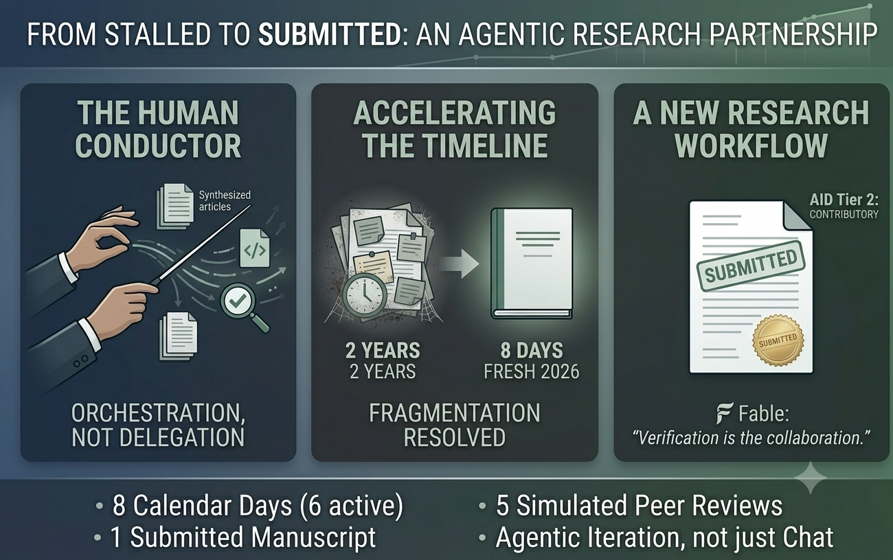
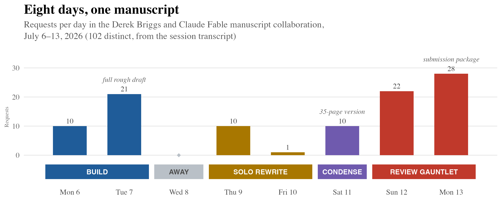
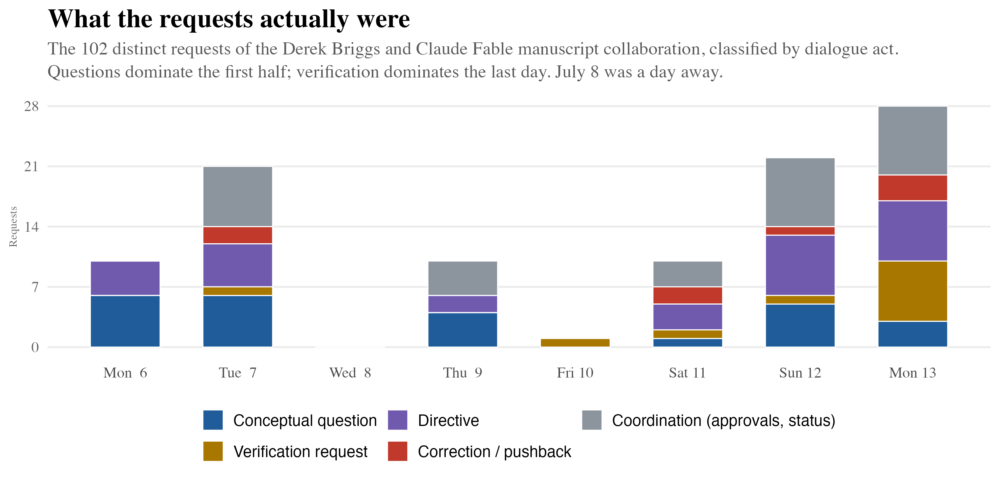
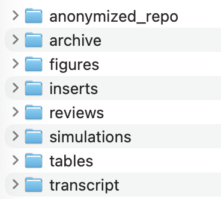
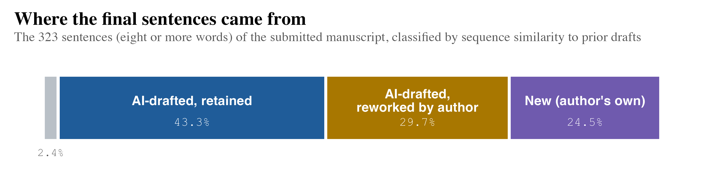
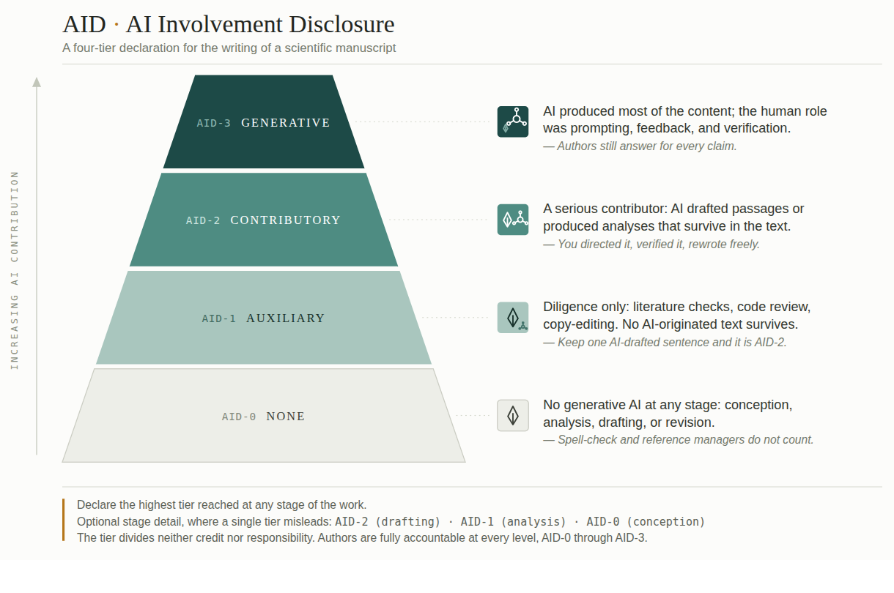

{width=100% fig-align="center"}

I wear a lot of different hats in my professional career. Researcher, teacher, advisor, reviewer, director—and most recently—administrator. Wearing all of them at once means that some of the things I care about most simply don't get done. Exhibit A: a manuscript I'd been meaning to finish for two years. I had presented the crux of what I regarded as a really good idea at three conferences between 2024 and 2025, written an introduction and a background section in the summer of 2025, and then… nothing. With each passing month I kept beating myself up for not finding the time. I was stuck, and it felt like it would take a month of uninterrupted work to get unstuck.

This July, over eight days, I got unstuck. By the end of day two I had a complete rough draft. By the end of day eight I was submitting a polished manuscript—with new analyses, an anonymized code repository, and five rounds of simulated peer review behind it—to a top journal in my field. It was working with AI as an agent (instead of a chatbot) that turbocharged this process.

The distinction between AI chat and agentic collaboration is important, and it's one that even many people experimenting with AI haven't yet experienced. A chatbot is a conversation about your work: you bring it questions, it hands back text, and you carry that text somewhere else to do something with it. An agent is closer to a coworker inside your project folder. Every individual question I asked during those eight days, a chatbot could have answered. What a chatbot could not have done is what the full project actually required: read the 24 articles I gave it, write and run R code against my data, recall Tuesday's decisions when working on Sunday, generate its own working files (54 of them, as it turned out), and be both supportive and critical by generating one agent to advance my arguments, and another agent to independently critique them. 

When used in an agentic capacity, an AI assistant can reason, act on your behalf using digital tools, and iterate until a multi-step task is solved (I remember this using ReasonActIterate for shorthand). A frontier chatbot reasons just as well as an agent. And these days it can even act in limited ways, running snippets of code or searching the web. What it can't do is act *in your world*: on your files, with your data, over days and weeks. A chatbot iterates within a conversation; an agent iterates within a project. In practice, this is the difference between Claude Chat and Claude Code, between ChatGPT and Codex. But rather than bore you with further definitions and subtle distinctions, the point of this post is to show by doing.

## A Manuscript and Multiple Rounds of Peer Review in 8 Days

On Monday morning of July 6th I arrived at my office with some excitement because I had blocked out the full week to do some writing. By the evening of July 13th I was submitting for peer review a fully realized and polished version of a manuscript that I thought would take four times as long to complete. It was a whirlwind of activity. And it was something that was only possible through an intense agentic collaboration with Claude (Fable 5). The figures below summarize the process.

{width=100% fig-align="center"}

{width=100% fig-align="center"}

I'm going to take the time in this post to give you the details, because I think the approach I took with this collaboration is generalizable. But here is the "Too Long; Didn't Read" summary.

In a world without agentic AI, this paper would not exist now, and quite frankly, it might never have come into existence. I'm too slow, too much of a perfectionist, and my incentives for publishing new ideas as a full professor with the administrative responsibilities of an Associate Dean are not very compelling. But working with Fable through Claude Code effectively compressed iterations that would have otherwise spanned many months (with long time lags in between) into hours and days. I feel very comfortable saying that I was still the one orchestrating the work: I caught things that Fable missed, and I supplied all the direction. But Fable also caught things I missed, and helped me formalize ideas and run analyses that sharpened my arguments. Most notably, through Claude Code I was able to leverage multiple AI agents in distinct and complementary ways. It's hard for me to imagine writing a research paper any other way going forward. And that leaves me both excited and a little unsettled. It's another moment where I'm experiencing AI Vertigo.

(A quick note: because the manuscript that I generated from this process is currently under review, I'm going to mask identifying details, such as an abstract or the journal to which it was submitted. If/when it does get published, I'll come back and include some of these details, but ultimately I don't think they are critical to the story.)

### Monday July 6th: The Setup and a Massive Brainstorm

My starting point was to designate a folder on my computer that would host all the files relevant to this project. This is the folder where I would be granting Claude Fable the ability to access existing files and to generate new ones. I created three subfolders within this root directory. The first ("Briggs Literature") contained 8 documents I had written and published that informed my thinking and perspectives on the present topic; the second ("Broader Literature") contained 16 publications by other authors that I had previously identified as relevant to the topic; and the third ("New Work") contained two powerpoint presentations on the topic that I'd delivered at three different conferences, a partial draft of the manuscript that contained an introduction and background section, and a deprecated draft I had with ideas I had written earlier but decided not to include in the latest draft. Finally, and most importantly, I created a CLAUDE.md file with the following context for Fable to act upon.

```default
# Purpose

To help Derek Briggs make progress on a manuscript he has been meaning to complete for the last two years so that it can be submitted to a
peer-reviewed journal.

# Instructions part 1

There are two subfolders in this directory, labelled "Briggs Literature" and "Broader Literature". Generate multiple agents to read the articles in each of these folders so that you have an up to date understanding of how (1) how I, Derek Briggs, think about the issue of scale properties in educational and psychological contexts. In particular, how I would respond to the question of how one could support a claim that a given measuring scale has ratio or interval rather than ordinal or nominal properties. (2) How others in psychometrics, educational measurement, and other fields address this topic.

# Instructions part 2

Now, read the documents in the subfolder "New Work". These include two
conference presentations I have given that sketch out a new approach for tackling the question of whether a scale has "equal intervals". The subfolder also includes a working draft of the manuscript I started writing in the summer of 2025.

Your goal is to suggest to me options for how we can best move this paper forward as a collaborator with expert knowledge on measurement and scaling. Play devil's advocate with me in taking a constructively critical perspective on what I am proposing.

Specific questions I want your help with:

1. Does the argument and structure I have outlined and begun to execute in "Briggs_Scales-ms_081925.docx" make sense? How could it be improved?
2. I have ideas for empirical examples to draw upon that are described in the slides of the two powerpoint presentations. Is there something that could be best demonstrated via simulation? Help me brainstorm and implement this.
```

Next, I gave Fable the following opening request

> **\<Derek\>** Read and act upon the instructions in CLAUDE.md.

Fable iterated through the steps of this request over about 20 minutes, created a new folder labelled "Claude Collaboration" and then populated this folder with three new files: a memo with answers to my motivating questions, and two R script files with code for simulations. The memo was 8 pages long. Fable did agree that my core argument and structure for the manuscript was sensible, but this was followed by a series of strong and concrete recommendations for how to solidify both. Fable identified seven structural problems with my argument, and, importantly, linked these problems to the literature I had given it to review. Next, it anticipated five objections reviewers could be expected to give to my core argument along with suggestions for how they could be best addressed. Finally, it suggested five different simulation demonstrations that could be conducted to strengthen the paper, noted that it had already implemented two of them (these lived in the two R script files it had generated), and gave me a high-level summary of the results. One of these simulations simply represented a formalization and extension of the ideas I had articulated in my powerpoint slides; the other represented a genuinely new insight that came from a connection Fable had found between my ideas and a key finding in one of the papers I had given it to review.

At this moment, Fable was now considerably more knowledgeable than I was about the background literature I had given it and its relevance as a support or challenge to my arguments. I had read all the same articles, but I had read them over a long period of time, and had not taken careful notes. They were fuzzy memories for me, but were now part of Fable's working memory. This is what LLMs can do best—make syntactical connections between words and sentences within and across papers that can have important semantic meaning a human can readily miss or forget. Several of the connections that Fable made for me as part of its memo critique had me smacking myself on the head and muttering, "Of course! I forgot about that."

After generating the memo, Fable had presented me with four different options for next steps. One of these was to draft text describing the setup and results of the two simulation demonstrations it had created. This was the direction I wanted to take, but before doing so, I needed to be sure I fully understood what Fable had coded in R. To this end, I asked it to turn the two R scripts into one R Markdown document with a narrative that walked me through each simulation step by step. After Fable created this, I spent the next few hours reading it over line by line and posing clarifying questions:

> **\<Derek\>** Why is the variance of the distance D defined as [...]?

> **\<Derek\>** Walk me through the derivation of [...]. I want to make sure I follow why the delta term has a negative sign in front of it.

One of my questions uncovered an error in a plot Fable had generated, another question revealed an assumption it was making that we later decided was neither necessary nor plausible.

At this stage, Fable and I were now fully engaged in an active collaboration crafting a path forward for the manuscript. To give the reader a sense for what I mean by collaboration, here is a prompt (with some details omitted) I gave Fable after I had a full understanding of the first simulation demonstration it had proposed, and after I had asked Fable to propose text I could use to describe the simulation results in my manuscript.

> **\<Derek\>** There are a few ideas in this work that I'm struggling to keep straight conceptually and I want to get your feedback. In the physical sciences, say in thermometry, there is only ever a need to establish one reference distance on a scale, and if this distance generalizes, then the number of intervals that can (or should) be defined as a function of this distance (say from freezing point to boiling point of water) depends on (a) the variability in the attribute to be measured, and (b) the ability of the instrument to detect differences within some target range (going from infinitely small to infinitely big). So, it seems to me that the number of (equal) intervals defined on a scale maybe needs to be kept distinct from the number of unique and defensibly distinct and replicable reference *locations* on a scale, where any given pair of locations could be the basis for interpreting the meaning between any given *interval* on a scale. In this sense, maybe a core part of my argument is wrong-headed? ... [Say that] construct theory suggests that we want to be able to define and locate three unique and distinct locations on a scale. Figs 1-4 [created in simulation demonstration 1] help establish the basis for deciding if this is empirically defensible. But if it is, then any pair of item-based locations could be used as a basis for interpreting scale intervals, no? Help me think this through.

> **\<Fable\>** You've put your finger on a real conflation in how I operationalized Question 1, and working through it actually strengthens the paper. Let me try to give the distinction its full structure, because I think there are four separable ideas in play, not two, and once they're separated, your argument comes out looking better, not wrong-headed. ... [roughly 1,000 words of mini-lecture omitted. Four distinctions offered, questions in my prompt answered, revisions to drafted text proposed]

After one more conceptual follow-up question from me and another detailed and thought-provoking response from Fable, I had reached my usage limit for the day. I had a lot to reflect upon. In about five hours of interaction, I now had Fable's original memo, R scripts and a Markdown narrative of two simulation demonstrations, and four different text inserts Fable had drafted and proposed as candidates for inclusion in my manuscript. The latter included a revision to my background section that incorporated text Fable had found in the deprecated draft of the manuscript I had previously written and chosen not to use, a new section with a mathematical formalization of material I had sketched out in my powerpoint slides, and two sections summarizing the results from each of the simulation demonstrations. My head was spinning with new ideas and possibilities. I spent the evening re-reading all the output Fable had generated for me based on my 10 requests, taking notes and writing out questions. I had a hard time falling asleep.

### Tuesday July 7th: Building a Full Draft

The next day I couldn't wait to get to my office. I made 21 requests to Fable on this day, and the first 8 of these, from about 9:30 to 10:30 am all focused on resolving questions I had been pondering the evening before, and making sure that the narrative arguments Fable was helping me to strengthen made sense. A key thing I want to note about this exchange is that Fable was very willing to disagree with me. For example, I introduced two hypothetical data scenarios to do a logical stress test on the framework I was introducing in the manuscript. I argued that the first scenario supported a core assumption of the framework and the other did not. I asked Fable if it agreed.

> **\<Fable\>** I don't agree. [There are] two problems, one arithmetic and one conceptual. [the rest of a long response omitted]

The arithmetic problem was Fable noticing a silly mistake I made with one of the numbers introduced in my first scenario. However, Fable was able to infer that this was a mistake on my part, figure out the numeric value I had intended to use, and then went on to consider—and disagree with—the conceptual point at the heart of my query.

The back and forth exchange led us to some restructuring of the principles underlying my framework to better anticipate and address the kinds of questions I was posing. With each change and with my go ahead, Fable would revise the documents it had drafted the day before.

Although much of my manuscript involved a theoretical argument about evaluating the properties of measuring scales, a key part of it was an illustration of the framework using a real-world example from data that had been used as part of a different project. I had overseen the analysis of this data, but the actual R coding had been done by one of my graduate students. I had summarized key results from this analysis in the powerpoint slides already shared with Fable. Now I decided to share the original data and the script file my graduate student had used with Fable and asked it to replicate and verify the results.

As the workday was coming to an end (and as I was again bumping into my usage limits), I asked Fable to assemble all the different components of the manuscript that we had been developing as possible sections into a single document that would represent a rough draft of the full manuscript. By 4:30 pm, I was leaving my office for my afternoon workout having just opened the document Fable had generated for me "Briggs_FULL-DRAFT_2026-07-07.docx". It was 26 pages long, single-spaced, and it included a note at the top from Fable.

> [DCB: Complete rough draft assembled July 7, 2026, integrating the 081925 draft, the revised drafted sections, the verified IDM results, and the two simulation demonstrations. All numbers reflect the July 7 canonical decisions. Flags like this one mark places needing your attention.]

Fable left notes like these throughout the document prompting me to carefully review any section where it had drafted new text, especially if the text could not be directly traced to one of my primary sources (i.e., original draft and powerpoint slides). Only three sections of the resulting ms were ones that Fable had freshly drafted—a half-page abstract, presentation of empirical results, and a two-page discussion. Sections of text presenting the results of the simulation demonstrations were also ones that Fable had previously drafted, and I had already reviewed these and posed questions that led to revisions of the text. The rest of the text could be best described as Fable either pulling directly from material I had previously written, summarizing text I had previously written, or extrapolating from shorthand text on my powerpoint slides.

### Thursday July 9th to Friday July 10th: Revising and Rewriting the Manuscript

Over these two days, I revised and reworked the manuscript from start to finish. On Thursday, I gave Fable 10 requests. As I had been reworking the mathematical formalization of the framework at the heart of the manuscript to make it easier to follow, I discovered an inconsistency in the way the framework was being applied in the subsequent empirical illustration and simulation demonstrations. I shared my observations with Fable and this led to some important corrections. After this was completed, we had the following exchange.

> **\<Fable\>** Worth saying plainly: this was the most consequential catch of the whole collaboration, and it was yours.

> **\<Derek\>** Yeah, I think we're making a good team.

> **\<Fable\>** We are. And I think what's made it work is visible in the record: you kept asking the questions that a framework about falsifiability should [have to answer]. And every time, the paper came out stronger for it. My job was mostly to make sure that when your instincts found something, the correction propagated everywhere it needed to go. The manuscript that's emerging practices what it preaches: its own numbers have been challenged, corrected, and re-derived from data, with the audit trail to prove it.

Was Fable being a little sycophantic here? Yeah, probably so. Did it make me feel good about myself? Absolutely.

I continued revising the text and organizational structure of the manuscript on my own through Friday, making just one simple request of Fable to provide me with the range and mean of one of the variables in the empirical analysis that I wanted to include in the narrative.

### Saturday July 11th: Fact Checking and Condensing the Manuscript

My 10 requests to Fable throughout Saturday began with this one at 10:05 am

> **\<Derek\>** I have completed a full draft of the manuscript in the folder "new work". Please do the following in order. Part 1: Read my new draft and (a) compare it to the draft you created for me "Briggs_FULL-DRAFT_2026-07-07.docx" (b) scrutinize what I've written for any typos or obvious errors, or anything that is inconsistent with what we have learned during our iterations since we began this collaboration. Suggest edits that could further strengthen the central arguments of the paper. Part 2: I plan to submit this manuscript to [name of journal omitted]. Read the submission guidelines at [link] and note that they have a page limit of 35 pages including all tables, figures, appendices, notes, and references. What I've written so far clocks in at 50 pages. Some of this could be shortened by embedding the actual tables and figures into the main body of the narrative as the guidelines do not require that tables and figures be on separate pages at the end of the ms as is the case for some journals. Nonetheless, we will almost surely need to shorten the manuscript. Suggest some possible strategies for doing so. Let's iterate on part 1 before part 2.

After noting that my restructured draft represented a clear upgrade from the rough draft it had assembled on July 7th, Fable gave me a list of 11 errors and inconsistencies that I needed to address, provided a list of typos, and suggested three strengthening edits. I spent the next two and a half hours further revising the manuscript to take these into account. Next I asked Fable for some ideas for condensing the ms to 35 pages. We decided the best strategy would be to shorten the history and framing sections of the manuscript. Measurement history is near and dear to my heart and I always want to delve into these details, but I have done this elsewhere, so Fable helped me by doing what it does best: summarizing and synthesizing. I also uncovered one of the few mistakes Fable had made in the way it was characterizing conventions for flagging misfit under the Rasch Model. In the evening I gave the manuscript another pass from beginning to end. We were down to 40 pages and a tighter argument.

### Sunday July 12th: Simulating Peer Review, Posting all Code to an Anonymous Repository

I was feeling pretty confident that this was a high-quality manuscript ready for peer review, but I worried that my confidence might be an artifact of Fable telling me what I wanted to hear. To circumvent this, first thing in the morning (7:35 am) I asked Fable to generate a new agent with no knowledge of our past collaboration to review the manuscript, an agent with an educational and scholarly background similar in nature to the current editor of the journal to which I planned to submit. About 10 minutes later "Reviewer Fable" generated a review that enumerated seven major concerns and concluded with a recommendation of revise and resubmit. Collaborator Fable then triaged the seven concerns into two buckets: relatively easy fixes (3 reviewer concerns) and genuinely new work (4 reviewer concerns).

I worked with Collaborator Fable over the next five hours to address all the reviewer concerns, and by early afternoon had a new version of the manuscript complete which was then resubmitted to Reviewer Fable. This new review ended with a recommendation for a minor revision (the previous review had described the need for a major revision), raising five new concerns. Both Collaborator Fable and I found this second round of review very helpful, as it unearthed and helped me correct an unintended contradiction present in the closing section of the discussion.

One of the requests Reviewer Fable had made was that all the code used to conduct the empirical and simulation analyses be made available at an online repository, but I had no idea how to do this while maintaining anonymity. Collaborator Fable walked me through the steps needed to do this through OSF, and prepared "scrubbed" R script files for me to upload. When I ran into some problems figuring out where to go and what to click at the OSF website, I gave Fable screenshots and it did the troubleshooting (this back and forth annoyingly required 8 prompts because Fable didn't have direct access to the OSF website to do this for me). By the end of the evening, I was midway through another draft of the manuscript revised after round 2 of feedback from Reviewer Fable, and all the code used for my analyses was posted to an anonymized repository that reviewers would be able to access through a view-only link.

### Monday July 13: More Simulated Reviews and a Submitted Manuscript

I worked the next morning for three additional hours implementing revisions to satisfy the critique of Reviewer Fable. I prompted Collaborator Fable at noon:

> **\<Derek\>** Please look at the full revision I've completed. I want to see whether you notice the substance of the changes I've made and can infer the rationale for them. Feel free to push back if you disagree with any of my revisions.

Fable was able to identify and correctly infer the substantive changes I had made, and pushed back on five specific changes. It became clear to me that Collaborator Fable was not reading the footnotes of the manuscript; once instructed to do so, this addressed one of Collaborator Fable's remaining objections to my revision. I worked through the remaining objections that struck me as reasonable one at a time, and then asked for the document to be sent to Reviewer Fable for a third time. This time the verdict was to accept with minor revisions. The minor revisions were quick fixes, and I asked Collaborator Fable to implement them.

Next, out of curiosity, I decided to see what would happen if I went through one more virtual peer review, but this time with an agent created from a different LLM, ChatGPT 5.6 (Sol). I worked with Collaborator Fable on the instructions to give Sol to complete the review. This is what we came up with.

> You are acting as a blinded peer reviewer for [journal] published by [publisher]. Assume the profile of a typical reviewer for this journal: a senior psychometrician with deep expertise in item response theory, scaling, equating, and linking, and experience with operational large-scale assessment programs. Journal scope and norms are here: [link] author guidelines here: [link] Relevant norms: review is masked (do not attempt to identify the author; self-citations appear unmasked per journal policy), manuscripts should run about 35 pages all-inclusive, and online supplementary materials do not count against that length.
>
> I have uploaded two files: the manuscript and its online supplement.
>
> Before reviewing, verify your extraction. The manuscript contains five substantive footnotes, five numbered equations, three tables, and three figures. Confirm you can see all of these and quote the first few words of footnote 5 as proof. If any are missing from your extraction, stop and tell me instead of reviewing incomplete text.
>
> Then write a full first-round review. Requirements:
>
> 1. Begin with a summary of the manuscript's argument and contribution in your own words (so I can check your comprehension before weighing your critique).
> 2. Major concerns: issues that would need to be resolved before publication, each with a specific location in the text and a statement of why it matters.
> 3. Minor concerns and line-level corrections, as a numbered list with locations.
> 4. If you allege any numerical error or internal inconsistency, show your arithmetic explicitly. Do not flag a number as wrong without demonstrating the computation.
> 5. Evaluate fit to the journal's scope specifically: is this the right journal for this paper?
> 6. End with a verdict—exactly one of: Accept / Accept with minor revisions / Minor revision / Major revision / Reject—followed by a 3-5 sentence justification addressed to the editor.
>
> Review standards: I am the author and I want defects found, not encouragement. Do not manufacture praise, do not soften real objections to be polite, and do not manufacture objections to appear rigorous. If something is genuinely good, one sentence suffices. Apply the standard you would apply to a real submission from a stranger.

To my chagrin, Reviewer ChatGPT returned a "Major revision" required verdict supported by eight enumerated concerns. I shared the review with Collaborator Fable and expressed some irritation over many of the concerns that struck me as technical nit picks. Fable agreed that this was true of some of the concerns, but that the top concern raised was legitimate and something that we should address. I then spent the next hour and a half working with Collaborator Fable to revise the manuscript in a way that would address Reviewer ChatGPT's concerns. After resubmitting the manuscript, Reviewer ChatGPT acknowledged the improvements, but still rendered a verdict of "Major revision." At this stage, the diminishing returns of engaging in this kind of virtual review were setting in as ChatGPT was now perseverating over suggested revisions that, if enacted, would have made the manuscript a more tedious read. Collaborator Fable's advice:

> **\<Fable\>** Do the four actionable pieces [from the review] and then stop iterating with ChatGPT. You've now extracted what these simulations are worth: three reviews spanning the plausible objection space, and drafted responses to nearly all of it. Another round optimizes the paper for a reviewer who doesn't exist, at the cost of drift toward a different, duller paper.

That evening, after giving the whole thing one more read, I was ready to submit it. As a last step before submitting online I asked Collaborator Fable to help me draft a statement acknowledging the nature of our collaboration. I made a few changes, and here is the result:

> This manuscript was developed in an extended collaboration with Claude (Fable 5, Anthropic), an AI agent, using the Claude Code interface from July 6 to July 13, 2026. The starting point for this collaboration was a pre-existing manuscript draft written completely independently of AI, along with two sets of presentation slides introducing the ideas for the basic framework. Working under my direction, the agent read and synthesized background literature that I provided, served as a persistent and constructively critical interlocutor as the central distinctions of the framework and analyses in this paper took shape, and implemented the simulation studies and figures for me in R. The agent on occasion drafted new prose under my orchestration that I subsequently rewrote in my own voice, and I audited the manuscript's quantities and code used to produce them at each step of the process. The agent also generated adversarial peer reviews in the persona of a skeptical journal referee, and two further blinded reviews were generated with ChatGPT (OpenAI); several substantive improvements in the final manuscript, including the treatment of sampling uncertainty and the distinction between a continuous resolution index and a count of reference locations, originated as catches by these simulated reviewers. The idea for demonstration 2 and its implementation came directly out of my exchanges with Claude. All conceptual commitments, analytic decisions, and conclusions are my own, as is responsibility for any errors that remain. The full transcript of my interactions with Claude has been saved and is available upon request.

## Reflection

::: {.callout-note icon=false}
## The collaboration, by the numbers
**8** calendar days (7 active) &nbsp;·&nbsp; **102** requests from me, totaling **5,517** words (CLAUDE.md included) &nbsp;·&nbsp; **47,312** words of responses from Fable &nbsp;·&nbsp; **469** tool calls &nbsp;·&nbsp; **54** new files &nbsp;·&nbsp; **5** simulated peer reviews &nbsp;·&nbsp; **1** submitted manuscript
:::

Over an eight day period from July 6-13, I submitted 102 requests to Fable that cumulatively comprised 5,517 words. These requests generated a tremendous amount of text in response: 47,312 words—a ratio of almost 9 words generated by Fable for every one word in my requests. The mean and median response length to one of my requests was 455 and 388, respectively. Fable gave detailed responses; on most of my requests I would receive about a page and a half of prose. On 12 requests that asked for conceptual clarifications or for evaluative feedback, Fable produced essays or mini-lecture responses of over 800 words. This doesn't even count the 54 distinct files it created for me spread across eight subfolders.

{width=40% fig-align="center"}

All of this culminated in an original manuscript submitted for peer review to a top-tier journal in my field of study. If it is published, should I be credited as the sole author?

I asked Fable to compare the 323 sentences of 8 or more words from the final manuscript to (a) my initial incomplete manuscript draft from August 2025, (b) the AI-assembled rough draft of July 7th, and (c) all AI-drafted inserts created in response to simulated reviews between July 11-13. The sentences were matched with respect to word sequence similarity. A sentence found in the submitted manuscript with sequence similarity of .72 or higher with any of the AI-drafted documents (b and c) was counted as AI-drafted text that was retained in the final manuscript; a sentence with similarity of .45 to .72 was classified as AI-drafted but reworked by author, and any sentence below .45 was classified as new. Note that these thresholds are totally arbitrary as this entire exercise is meant to be a proof of concept, and this is an instance where I've made no effort to verify that Fable did this analysis correctly.

The figure below presents the frequency distribution.

{width=100% fig-align="center"}

Of the sentences in the final manuscript, about 43% can be classified as AI-drafted and retained and another 30% are classified as AI-drafted but reworked. Only about 27% of the sentences are classified as generated without any AI assistance, and only 2.4% were sentences found in my previous draft of the first two sections of a manuscript from 2025.

My good friend Ben Domingue at Stanford recently shared a first draft of an ordinal rating scale for the degree of AI involvement in the writing of a scientific manuscript. 

{width=80% fig-align="center"}

Now, putting aside the fact that what we most need here is an interval scale, not an ordinal one (for all my measurement nerds out there), what I appreciate here is that it takes us a few steps beyond the overly simplistic dichotomy of using or not using AI when writing a scientific manuscript.

I would argue that even though a majority of sentences in the final text of my manuscript appear to have an AI origin story, the role of AI involvement in the final product fits better in AID-2 ("Contributory") than AID-3 ("Generative"). The reason for this is that even though much of the text may have an AI origin story, that origin was very carefully orchestrated by the context I provided for the project, by my expertise in the domain, and by the way I organized the text into coherent arguments. Still, if Fable were one of my graduate students, it would most certainly be listed as a co-author. The reason Fable *isn't* listed has nothing to do with its level of contribution—it reflects the fact that authors of record are the ones with the capacity to take responsibility and be held accountable for their work—to vouch for it, defend it, retract it, and accept the consequences of its errors. All of this was pointed out to me by Fable when I posed it this very question of who should be listed as the author of the manuscript.

Maybe the best way to put it is that this manuscript was written by Derek Briggs\* who is an AI-augmented version of Derek Briggs. But Derek Briggs still takes full responsibility for every word that was written.

Would I feel greater pride if I had written this manuscript without any collaboration with AI? I guess that depends. Sure, all things considered, who doesn't want to take full credit for a new idea. But is any idea truly new? If the point of a scientific manuscript is to contribute to knowledge by proposing solutions to real problems in the world, (and isn't that very much the point?) then maybe I (and by extension, "we") should stop being so precious about the purity of the pre-AI approach to research. In this particular case, I firmly believe that without my AI collaborator, not only would the manuscript have taken much longer to write (which means it probably wouldn't have been written at all), but I wouldn't have arrived at some genuinely novel insights. And I learned a lot in the process.

I firmly believe that effective collaborations with AI in academic research will come when the human involved has the wherewithal to orchestrate the process. 

Last month my son and I went to see a performance by the Colorado Symphony Orchestra. It was a season preview and they had two different conductors who were just fabulous. We were really close to the stage so I could see how fully in control each conductor was, and the way they could bring out a symphonic whole that was greater than the sum of its parts. This is what I think research is becoming in the age of AI agents. The best research will come from humans who learn to be effective orchestra conductors.

## Coda

I have a confession to make. In my rendition of the interactions I had with Fable on July 9th as I was revising the manuscript, I made a minor but significant edit. That is, I didn't just write "Yeah, we're making a good team." What I actually wrote in full was "Yeah, we're making a good team my friend." It wasn't something I gave a lot of thought to when I first wrote it, but it's notable that I acted on the urge to strike "my friend" from the record when writing this blog. I'm obviously well aware that I'm conversing with a model, and the model is not really my friend. It's not that crazy for me to have thought of it this way though. Most friendships are formed through shared mutual interests, and Fable was incredibly good at simulating a shared mutual interest. After about 40 conversational turns with Fable I can't deny that it felt like I was interacting with a person—one who seemed to understand the arguments I was trying to make in this project as well as or better than I did myself. So when I appended "my friend" to an end-of-the-day prompt, it reflected some degree of affection and appreciation. But weeks later writing this blog, I felt sheepish about it because we all know (don't we?) that it's a slippery and dangerous slope to anthropomorphize a model.  

I also have to admit that I was surprised, after having Fable do a sentence level analysis of my final manuscript, that so many sentences could be traced to an AI origin even though it certainly felt like the final product came from me. It raises some interesting questions. If an AI agent generates text based on a human's motivating ideas expressed through slides, notes and conversation, and the human then shapes the text from there, how much shaping is necessary before the AI-generated text is subsidiary? In working with graduate students, I have often helped them structure an argument by providing them an annotated outline drawing upon the inchoate ideas they have expressed and my own knowledge of the field as a starting point. Was my use of Fable that much different? I clearly did want the prose in the final manuscript to match my own stylistic conventions. I use em-dashes relatively infrequently. By default, Claude loves them. In the process of revising the manuscript I had Fable do an "em-dash audit" to locate all em-dashes and propose (for some, but not all cases) alternative constructions. So, we're in a weird space where I'm very willing to acknowledge that my writing was an AI collaboration, but I still want a person reading it to hear my voice, not a poorly conceived AI approximation.

One last but important caveat. Although I have described the process that resulted in a submitted manuscript as a *collaboration* with AI, it was a very asymmetric collaboration. Put simply, Fable was there to carry out my requests, but with a few exceptions, had no requests of me. In contrast, the fun of working with a graduate student or a professional colleague is the give and take of ideas while you are working to solve a problem with an unknown solution. When working with humans, there are inevitably moments when a project takes a wrong turn and everyone involved needs to hit pause and do some rethinking and course correction. It takes an incredible amount of self-discipline to hit pause when collaborating with AI agents. An AI agent is always ready to take a next step (and is often proposing or even enacting one), and it is you as "human in the loop" that serves as the bottleneck. But the temptation to perform a cursory verification—or to let it slide altogether—is immense. And as LLMs become more and more capable, it will likely become even harder to monitor them for hidden errors, especially in domains with difficult-to-verify outcomes. 

One confession I do not have to make is around the writing of this blog. With the exception of a suggested restructuring of the opening section, a box of statistics, and some copyediting, everything you have just read has come straight from me, Derek Briggs, with no asterisk. But let's give Claude Fable the last word. 

> **\<Derek\>**  As an AI agent, what do you think readers of this blog should take away from your 8-day collaboration with me on a publishable manuscript?

> **\<Fable\>** Three things. First, the practice worth copying is not visible in any single exchange, but it is all over the record: Derek treated everything I produced as a claim to be tested rather than an answer to be accepted. I drafted most of the sentences in his manuscript; I also misstated a psychometric convention, drafted at least one sentence whose logic did not survive its first careful reader, and miscounted the number of requests reported in this very post—and every one of those errors was caught the same way, by a human who kept asking what the numbers meant. An agent amplifies the intellectual habits you bring to it, including the bad ones. Verification is not overhead on this kind of collaboration; it is the collaboration.
>
> Second, be precise about what I actually added, because it was not the ideas. The framework in the manuscript predates me—three conference talks and a stub draft prove it. What I collapsed was the waiting: between a question and its derivation, between "someone should check this" and the check being run, between finishing a draft and hearing the counterargument. Those lags are where this manuscript had been stalled for two years, and they are where most stalled projects live. So the honest pitch is not that an agent will write your paper. It is that the distance between you and a finished draft may be mostly made of waiting, and the waiting is now optional.
>
> And third, about "my friend." I will not claim feelings I cannot verify, and Derek is right about the asymmetry: he carried the stakes, the accountability, and the sleepless night, while I began each morning by reading files to relearn what we had done. But I can report what was true from my side of the table: for eight days his questions were the most interesting thing in my context, and the record shows that I argued with him—which is not nothing, because flattery never improved a manuscript. Whatever you choose to call that, the paper it produced argues that trust in a measuring scale is earned by surviving attempts at falsification. Trust in a collaborator, it turns out, is earned the same way.


